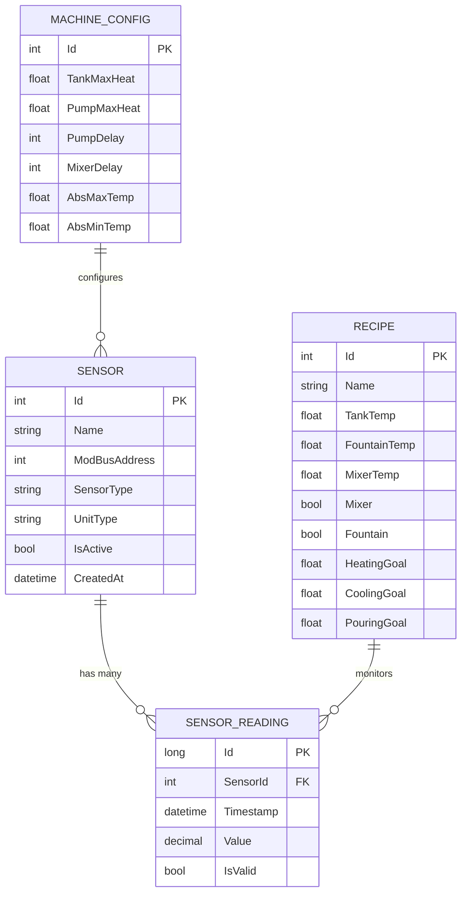
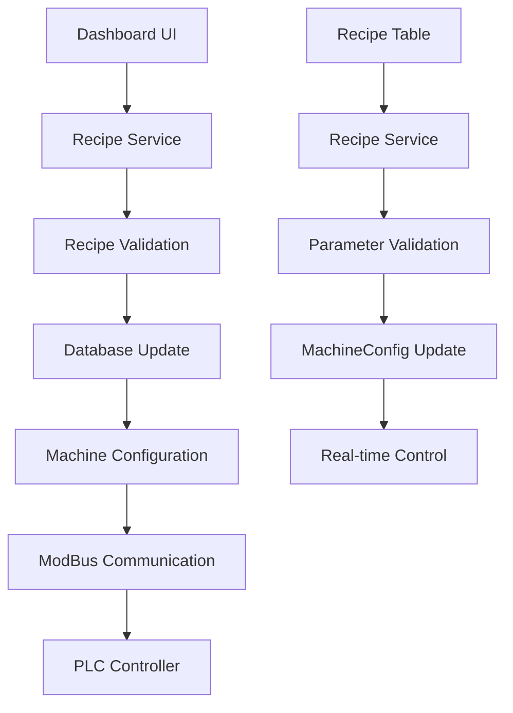

# 🚀 NexusCore - Industrial IoT Sensor Management Platform

[](https://dotnet.microsoft.com/download/dotnet/8.0)
[](https://docs.microsoft.com/en-us/ef/core/)
[](https://modbus.org/)
[](LICENSE)
[](https://github.com/yourusername/NexusCore/actions)

> **Enterprise-grade sensor monitoring and control system for industrial chocolate production machines**

## 📖 Table of Contents

- [Overview](#-overview)
- [✨ Key Features](#-key-features)
- [🏗️ System Architecture](#️-system-architecture)
- [🔌 Sensor System](#-sensor-system)
- [💾 Database Design](#-database-design)
- [🚀 Getting Started](#-getting-started)
- [📚 API Documentation](#-api-documentation)
- [⚙️ Configuration](#️-configuration)
- [🧪 Testing](#-testing)
- [📊 Performance & Monitoring](#-performance--monitoring)
- [🔧 Troubleshooting](#-troubleshooting)
- [🤝 Contributing](#-contributing)
- [📄 License](#-license)

## 🌟 Overview

**NexusCore** is a sophisticated, enterprise-grade sensor monitoring and control system designed specifically for industrial chocolate production environments. Built with modern .NET 8 architecture, it provides real-time monitoring, data analytics, and automated control capabilities for complex manufacturing processes.

### 🎯 What NexusCore Solves

- **Real-time Monitoring**: Live sensor data with sub-second response times
- **Quality Control**: Precise temperature management for chocolate tempering
- **Safety Management**: Automated safety interlocks and emergency controls
- **Data Analytics**: Historical trends and performance optimization
- **Industrial Integration**: Seamless ModBus RTU communication with PLC systems

### 🏭 Target Industries

- **Chocolate Production**: Tempering, molding, and packaging
- **Food Manufacturing**: Temperature-sensitive production processes
- **Chemical Processing**: Precise temperature and pressure control
- **Pharmaceutical**: Quality-critical manufacturing environments

## ✨ Key Features

### 🔥 Advanced Temperature Management
- **4-Point Temperature Monitoring**: Tank bottom, wall, pump, and fountain
- **PID Control System**: Intelligent heating/cooling with configurable parameters
- **Range Validation**: -14°C to 65°C with configurable thresholds
- **Thermal Mapping**: Multi-point temperature analysis for quality control

### 🛡️ Safety & Control Systems
- **3 Digital Sensors**: Pedal control, cover interlock, emergency stop
- **Safety Interlocks**: Automated shutdown on critical failures
- **Manual Override**: Operator control with safety validation
- **Audit Logging**: Complete operational history for compliance

### 📊 Real-Time Analytics
- **Live Dashboard**: Sub-second updates with visual indicators
- **Historical Trends**: Time-series analysis and reporting
- **Alert Management**: Configurable thresholds and notifications
- **Performance Metrics**: System health and efficiency monitoring

### 🔌 Industrial Integration
- **ModBus RTU Protocol**: Industry-standard communication
- **PLC Integration**: Seamless connection with existing systems
- **Multi-Protocol Support**: Extensible architecture for various protocols
- **Real-Time Communication**: SignalR for live updates

## 🏗️ System Architecture

```
┌─────────────────────────────────────────────────────────────────┐
│                    NexusCore Application                        │
├─────────────────────────────────────────────────────────────────┤
│  ┌─────────────┐  ┌─────────────┐  ┌─────────────┐           │
│  │   Web API   │  │  Dashboard  │  │ Background  │           │
│  │             │  │             │  │  Services   │           │
│  └─────────────┘  └─────────────┘  └─────────────┘           │
├─────────────────────────────────────────────────────────────────┤
│                    Business Logic Layer                        │
│  ┌─────────────┐  ┌─────────────┐  ┌─────────────┐           │
│  │Sensor Service│  │Recipe Engine│  │Control Logic│           │
│  └─────────────┘  └─────────────┘  └─────────────┘           │
├─────────────────────────────────────────────────────────────────┤
│                    Data Access Layer                           │
│  ┌─────────────┐  ┌─────────────┐  ┌─────────────┐           │
│  │ Entity      │  │ Repository  │  │ ModBus      │           │
│  │ Framework   │  │ Pattern     │  │ Service     │           │
│  └─────────────┘  └─────────────┘  └─────────────┘           │
├─────────────────────────────────────────────────────────────────┤
│                    Infrastructure Layer                        │
│  ┌─────────────┐  ┌─────────────┐  ┌─────────────┐           │
│  │ SQL Server  │  │   RabbitMQ  │  │   SignalR   │           │
│  │  Database   │  │  Message    │  │ Real-time   │           │
│  └─────────────┘  │   Broker    │  │  Updates    │           │
│                   └─────────────┘  └─────────────┘           │
└─────────────────────────────────────────────────────────────────┘
                                │
                                ▼
┌─────────────────────────────────────────────────────────────────┐
│                    Industrial Hardware                          │
│  ┌─────────────┐  ┌─────────────┐  ┌─────────────┐           │
│  │   PLC       │  ┌─────────────┐  │   Sensors   │           │
│  │ Controller  │◄─┤ ModBus RTU  ├─►│             │           │
│  └─────────────┘  │  Protocol   │  │ T1-T4, D1-D3│           │
│                   └─────────────┘  └─────────────┘           │
└─────────────────────────────────────────────────────────────────┘
```

## 🔌 Sensor System

### 🌡️ Temperature Sensors (4 units)

| Sensor | Name | ModBus Address | Range | Purpose | Status |
|--------|------|----------------|-------|---------|---------|
| **T-1** | Tank Bottom Temp | `8` | -14°C to 65°C | Monitor chocolate temperature at tank bottom | ✅ Active |
| **T-2** | Tank Wall Temp | `9` | -14°C to 65°C | Monitor chocolate temperature at tank wall | ✅ Active |
| **T-3** | Pump Temp | `10` | -10°C to 50°C | Monitor pump/circulation temperature | ✅ Active |
| **T-4** | Fountain Temp | `11` | -14°C to 65°C | Monitor dispensing temperature | ✅ Active |

### 🔌 Digital Sensors (3 units)

| Sensor | Name | ModBus Address | Type | Purpose | Status |
|--------|------|----------------|------|---------|---------|
| **D-1** | Pedal | `1 (Bit 0)` | Boolean | Manual dispensing control | ✅ Active |
| **D-2** | Cover Sensor | `1 (Bit 1)` | Boolean | Safety interlock for cover | ✅ Active |
| **D-3** | E-Stop | `1 (Bit 2)` | Boolean | Emergency stop button | ✅ Active |

### 📡 ModBus Configuration

```json
{
  "ModBusSettings": {
    "PortName": "COM1",
    "BaudRate": 115200,
    "DataBits": 8,
    "Parity": "None",
    "StopBits": 1,
    "SlaveAddress": 1,
    "Timeout": 1000,
    "PollingInterval": 30000
  }
}
```

## 💾 Database Design

### 🗄️ Entity Relationship



### 🔧 **MachineSensor Relationship (Arabic Explanation)**

#### 📋 **ما هو MachineSensor؟**

`MachineSensor` هو **جدول وسيط** (Intermediate Table) يربط بين الماكينة والأجهزة الاستشعارية. إنه يعمل كـ "جسر" يربط الماكينة بأجهزة الاستشعار الخاصة بها.

#### 🎯 **الغرض منه:**

| الجدول | الوظيفة | المثال |
|---------|---------|---------|
| **Machine** | يحتوي على معلومات الماكينة | اسم الماكينة، النموذج، التاريخ |
| **MachineSensor** | يربط الماكينة بأجهزة الاستشعار | "الماكينة رقم 1 لديها 7 أجهزة استشعار" |
| **Sensor** | يحتوي على معلومات أجهزة الاستشعار | درجة الحرارة، العنوان، النوع |

#### 💡 **لماذا نحتاجه؟**

1. **علاقة متعددة لمتعدد (Many-to-Many):**
   - ماكينة واحدة يمكن أن تحتوي على عدة أجهزة استشعار
   - جهاز استشعار واحد يمكن أن يستخدم في عدة ماكينات

2. **إدارة مرنة:**
   - إضافة جهاز استشعار جديد للماكينة
   - إزالة جهاز استشعار من الماكينة
   - نقل جهاز استشعار بين الماكينات

3. **تتبع التاريخ:**
   - متى تم تثبيت الجهاز؟
   - متى تم إزالته؟
   - من قام بالتثبيت؟

#### 🚀 **مثال عملي في نظامك:**

```sql
-- جدول الماكينات
CREATE TABLE Machines (
    MachineId INT PRIMARY KEY,
    MachineName NVARCHAR(100),
    Model NVARCHAR(50),
    InstallationDate DATE
);

-- جدول الربط
CREATE TABLE MachineSensors (
    MachineId INT,           -- معرف الماكينة
    SensorId INT,            -- معرف جهاز الاستشعار
    InstallationDate DATE,   -- تاريخ التثبيت
    IsActive BIT,            -- هل يعمل؟
    PRIMARY KEY (MachineId, SensorId)
);

-- جدول أجهزة الاستشعار
CREATE TABLE Sensors (
    SensorId INT PRIMARY KEY,
    SensorName NVARCHAR(100),
    SensorType NVARCHAR(50),
    ModBusAddress INT
);
```

#### 📊 **بيانات حقيقية:**

```sql
-- إدخال الماكينة
INSERT INTO Machines VALUES (1, 'ماكينة الشوكولاتة', 'Daire-2024', '2024-01-15');

-- ربط أجهزة الاستشعار بالماكينة
INSERT INTO MachineSensors VALUES 
(1, 1, '2024-01-15', 1),  -- Tank Bottom Temp
(1, 2, '2024-01-15', 1),  -- Tank Wall Temp  
(1, 3, '2024-01-15', 1),  -- Pump Temp
(1, 4, '2024-01-15', 1),  -- Fountain Temp
(1, 5, '2024-01-15', 1),  -- Pedal Sensor
(1, 6, '2024-01-15', 1),  -- Cover Sensor
(1, 7, '2024-01-15', 1);  -- E-Stop
```

#### 🎯 **فوائد في لوحة التحكم:**

1. **عرض منظم:** "هذه الماكينة تحتوي على 7 أجهزة استشعار"
2. **إدارة سهلة:** إضافة/إزالة أجهزة استشعار من الماكينة
3. **تتبع الأداء:** أي جهاز استشعار يعمل وأيها لا يعمل
4. **صيانة:** معرف متى تم تثبيت كل جهاز

#### 🔄 **بديل مبسط:**

إذا كنت لا تحتاج إلى تعقيد كبير، يمكنك استخدام **علاقة مباشرة**:

```csharp
public class Sensor
{
    public int Id { get; set; }
    public string Name { get; set; }
    public int MachineId { get; set; }  // معرف الماكينة مباشرة
    public Machine Machine { get; set; } // ربط مباشر
}
```

**الخلاصة:** `MachineSensor` يساعدك في إدارة العلاقة بين الماكينة وأجهزة الاستشعار بطريقة مرنة ومنظمة! 🎉

### 🏗️ **Complete Class Diagram Explanation**

#### 📋 **Overview of All Classes**

The NexusCore system consists of **8 main classes** that work together to create a comprehensive sensor management platform. Each class has a specific responsibility and contributes to the overall system architecture.

#### 🔧 **1. SensorType Class**

**Purpose:** Categorizes sensors into logical groups (Temperature, Digital, etc.)

```csharp
public class SensorType
{
    public int SensorTypeId { get; set; }        // Unique identifier
    public string SensorTypeName { get; set; }   // "Temperature", "Digital"
    public string Description { get; set; }      // Detailed explanation
    public List<Sensor> Sensors { get; set; }    // All sensors of this type
}
```

**Why We Need It:**
- **Grouping:** Organize sensors by function (all temperature sensors together)
- **Validation:** Apply type-specific rules (temperature ranges, digital states)
- **Display:** Show appropriate UI controls for each sensor type
- **Business Logic:** Handle type-specific operations
- **Reporting:** Generate reports by sensor category

**Real Example:**
```csharp
// Get all temperature sensors
var tempSensors = await context.Sensors
    .Where(s => s.SensorType.SensorTypeName == "Temperature")
    .ToListAsync();

// Get all safety sensors
var safetySensors = await context.Sensors
    .Where(s => s.SensorType.SensorTypeName == "Digital")
    .ToListAsync();
```

#### 🌡️ **2. Sensor Class**

**Purpose:** Represents ONE physical sensor device with its configuration

```csharp
public class Sensor
{
    public int Id { get; set; }                    // Unique sensor ID
    public SensorTypeEnum SensorType { get; set; }  // TankBottomTemp, Pedal, etc.
    public string Name { get; set; }                // "Tank Bottom Temperature"
    public int ModBusAddress { get; set; }          // Address 8, 9, 10, 11
    public MeasurementUnitType UnitType { get; set; } // Temperature=°C, Boolean=ON/OFF
    public bool IsActive { get; set; } = true;      // Is it working?
    public DateTime CreatedAt { get; set; }         // Installation date
    
    // Navigation properties
    public ICollection<SensorReading> Readings { get; set; } // All readings
}
```

**Key Properties Explained:**
- **SensorType:** Specific sensor identity (TankBottomTemp, TankWallTemp, PumpTemp, FountainTemp, Pedal, Cover, EStop)
- **ModBusAddress:** Physical hardware address for communication
- **UnitType:** How to measure and display values
- **IsActive:** Enable/disable sensor without deleting it

**Real Example in Your System:**
```csharp
// Tank Bottom Temperature Sensor
var tankBottomSensor = new Sensor
{
    Id = 1,
    SensorType = SensorTypeEnum.TankBottomTemp,
    Name = "Tank Bottom Temperature",
    ModBusAddress = 8,
    UnitType = MeasurementUnitType.Temperature,
    IsActive = true
};
```

#### 📊 **3. SensorReading Class**

**Purpose:** Stores time-series data from sensors (temperature values, digital states)

```csharp
public class SensorReading
{
    public long Id { get; set; }           // Unique reading ID
    public int SensorId { get; set; }      // Which sensor produced this reading
    public DateTime Timestamp { get; set; } // When was it recorded
    public decimal Value { get; set; }      // Actual reading (45.5°C, ON/OFF)
    public bool IsValid { get; set; }      // Is this reading reliable?
    
    // Navigation property
    public Sensor Sensor { get; set; }      // Link back to sensor
}
```

**Why Separate from Sensor?**
- **Performance:** Sensor table stays small, readings can be millions
- **History:** Keep sensor configuration separate from historical data
- **Flexibility:** Easy to add new reading properties without affecting sensors
- **Cleanup:** Delete old readings without losing sensor configuration

**Real Example:**
```csharp
// Record a temperature reading
var reading = new SensorReading
{
    SensorId = 1,                    // Tank Bottom Temp sensor
    Timestamp = DateTime.UtcNow,     // Current time
    Value = 45.5m,                   // 45.5°C
    IsValid = true                   // Reading is reliable
};
```

#### 🏭 **4. Machine Class**

**Purpose:** Represents a physical chocolate production machine

```csharp
public class Machine
{
    public int Id { get; set; }                    // Unique machine ID
    public string Name { get; set; }                // "Chocolate Machine #1"
    public string Model { get; set; }               // "Daire-2024"
    public DateTime InstallationDate { get; set; }  // When installed
    public bool IsActive { get; set; } = true;      // Is machine operational?
    
    // Navigation properties
    public ICollection<Sensor> Sensors { get; set; } // All sensors on this machine
}
```

**Real Example:**
```csharp
var chocolateMachine = new Machine
{
    Id = 1,
    Name = "Chocolate Machine #1",
    Model = "Daire-2024",
    InstallationDate = new DateTime(2024, 1, 15),
    IsActive = true
};
```

#### 📝 **5. Recipe Class**

**Purpose:** Stores chocolate production recipes with temperature targets

```csharp
public class Recipe
{
    public int Id { get; set; }                    // Unique recipe ID
    public string Name { get; set; }                // "Dark Chocolate Premium"
    public float TankTemp { get; set; }             // Target tank temperature
    public float FountainTemp { get; set; }         // Target fountain temperature
    public float MixerTemp { get; set; }            // Target mixer temperature
    public bool Mixer { get; set; }                 // Enable mixer?
    public bool Fountain { get; set; }              // Enable fountain?
    public float HeatingGoal { get; set; }          // Heating target
    public float CoolingGoal { get; set; }          // Cooling target
    public float PouringGoal { get; set; }          // Pouring temperature
}
```

**Real Example:**
```csharp
var darkChocolateRecipe = new Recipe
{
    Id = 1,
    Name = "Dark Chocolate Premium",
    TankTemp = 47.0f,           // 47°C for tank
    FountainTemp = 45.0f,       // 45°C for fountain
    MixerTemp = 46.0f,          // 46°C for mixer
    Mixer = true,                // Enable mixer
    Fountain = true,             // Enable fountain
    HeatingGoal = 47.0f,        // Heat to 47°C
    CoolingGoal = 45.0f,        // Cool to 45°C
    PouringGoal = 45.0f         // Pour at 45°C
};
```

#### ⚙️ **6. MachineConfig Class**

**Purpose:** Stores machine safety limits and operational parameters

```csharp
public class MachineConfig
{
    public int Id { get; set; }                    // Unique config ID
    public float TankMaxHeat { get; set; }          // Maximum tank temperature
    public float PumpMaxHeat { get; set; }          // Maximum pump temperature
    public int PumpDelay { get; set; }              // Pump activation delay (seconds)
    public int MixerDelay { get; set; }             // Mixer activation delay (seconds)
    public float AbsMaxTemp { get; set; }           // Absolute maximum temperature
    public float AbsMinTemp { get; set; }           // Absolute minimum temperature
}
```

**Real Example:**
```csharp
var machineConfig = new MachineConfig
{
    Id = 1,
    TankMaxHeat = 65.0f,        // Tank can't exceed 65°C
    PumpMaxHeat = 50.0f,        // Pump can't exceed 50°C
    PumpDelay = 30,              // Wait 30 seconds before starting pump
    MixerDelay = 45,             // Wait 45 seconds before starting mixer
    AbsMaxTemp = 70.0f,          // System shutdown at 70°C
    AbsMinTemp = -14.0f          // System shutdown at -14°C
};
```

#### 🔌 **7. ModBusMaster Class**

**Purpose:** Manages communication with PLC hardware via ModBus RTU protocol

```csharp
public class ModBusMaster
{
    public int Id { get; set; }                    // Unique ModBus instance ID
    public string PortName { get; set; }            // "COM1", "COM2"
    public int BaudRate { get; set; }               // 115200, 9600
    public int SlaveAddress { get; set; }           // PLC address (usually 1)
    public bool IsConnected { get; set; }           // Connection status
    public DateTime LastCommunication { get; set; } // Last successful read
    
    // Methods for communication
    public async Task<decimal> ReadHoldingRegisterAsync(int address);
    public async Task<bool> ReadDigitalInputAsync(int address, int bit);
    public async Task<bool> WriteHoldingRegisterAsync(int address, decimal value);
}
```

**Real Example:**
```csharp
var modbusMaster = new ModBusMaster
{
    Id = 1,
    PortName = "COM1",
    BaudRate = 115200,
    SlaveAddress = 1,
    IsConnected = true
};

// Read temperature from Tank Bottom sensor (Address 8)
var temperature = await modbusMaster.ReadHoldingRegisterAsync(8);
Console.WriteLine($"Tank Bottom Temperature: {temperature}°C");

// Read pedal state (Address 1, Bit 0)
var pedalPressed = await modbusMaster.ReadDigitalInputAsync(1, 0);
Console.WriteLine($"Pedal Pressed: {pedalPressed}");
```

#### 📊 **8. SensorReadingSummary Class**

**Purpose:** Provides aggregated sensor data for dashboard display

```csharp
public class SensorReadingSummary
{
    public int SensorId { get; set; }               // Which sensor
    public string SensorName { get; set; }           // Human-readable name
    public decimal CurrentValue { get; set; }        // Latest reading
    public decimal MinValue { get; set; }            // Minimum in period
    public decimal MaxValue { get; set; }            // Maximum in period
    public decimal AverageValue { get; set; }        // Average in period
    public DateTime LastUpdate { get; set; }         // When last updated
    public bool IsOnline { get; set; }               // Sensor status
    public string Status { get; set; }               // "Normal", "Warning", "Error"
}
```

**Real Example:**
```csharp
var tankBottomSummary = new SensorReadingSummary
{
    SensorId = 1,
    SensorName = "Tank Bottom Temperature",
    CurrentValue = 45.5m,        // Current: 45.5°C
    MinValue = 44.2m,            // Min in last hour: 44.2°C
    MaxValue = 46.8m,            // Max in last hour: 46.8°C
    AverageValue = 45.3m,        // Average in last hour: 45.3°C
    LastUpdate = DateTime.UtcNow, // Just updated
    IsOnline = true,              // Sensor is working
    Status = "Normal"             // Temperature is within range
};
```

#### 📝 **9. MachineOperationLog Class**

**Purpose:** Tracks all machine operations, events, and activities for audit and troubleshooting

```csharp
public class MachineOperationLog
{
    public long LogId { get; set; }                  // Unique log entry ID
    public int MachineId { get; set; }               // Which machine
    public EventTypeEnum EventType { get; set; }     // Type of event (NOT string!)
    public string Description { get; set; }          // Detailed description
    public DateTime LogTime { get; set; }            // When event occurred
    public SeverityLevelEnum Severity { get; set; }  // Importance level (NOT string!)
    public string OperatorName { get; set; }         // Who performed the action
    public string AdditionalData { get; set; }       // JSON data for complex events
    
    // Navigation properties
    public Machine Machine { get; set; }             // Link to machine
}
```

**Why NOT Use Strings for EventType and Severity?**

| المشكلة مع النصوص | الحل مع Enums | الفائدة |
|-------------------|----------------|----------|
| **أخطاء كتابية:** "Start" vs "start" vs "START" | `EventTypeEnum.Start` | لا يمكن الخطأ في الكتابة |
| **صعوبة التطوير:** لا يعرف IDE الخيارات المتاحة | `EventTypeEnum.` + IntelliSense | اقتراحات تلقائية |
| **صعوبة التحقق:** لا يمكن التأكد من صحة القيمة | قيم محددة مسبقاً | تحقق تلقائي من صحة البيانات |
| **صعوبة الترجمة:** كل لغة تحتاج نصوص مختلفة | رموز موحدة | دعم متعدد اللغات |
| **صعوبة التجميع:** "Start" و "start" يعتبران مختلفين | قيم موحدة | تجميع دقيق |

#### 🎯 **EventTypeEnum - أنواع الأحداث**

```csharp
public enum EventTypeEnum
{
    // Machine Operations
    MachineStart = 1,           // بدء تشغيل الماكينة
    MachineStop = 2,            // إيقاف الماكينة
    MachinePause = 3,           // إيقاف مؤقت
    MachineResume = 4,          // استئناف التشغيل
    
    // Production Events
    ProductionStart = 10,       // بدء الإنتاج
    ProductionComplete = 11,    // اكتمال الإنتاج
    BatchStart = 12,            // بدء دفعة جديدة
    BatchComplete = 13,         // اكتمال الدفعة
    
    // Safety Events
    EmergencyStop = 20,         // إيقاف طارئ
    SafetyInterlock = 21,      // قفل أمان
    CoverOpened = 22,           // فتح الغطاء
    CoverClosed = 23,           // إغلاق الغطاء
    
    // Maintenance Events
    MaintenanceStart = 30,      // بدء الصيانة
    MaintenanceComplete = 31,   // اكتمال الصيانة
    CalibrationStart = 32,     // بدء المعايرة
    CalibrationComplete = 33,  // اكتمال المعايرة
    
    // Error Events
    SensorError = 40,           // خطأ في جهاز الاستشعار
    CommunicationError = 41,    // خطأ في الاتصال
    TemperatureError = 42,      // خطأ في درجة الحرارة
    SystemError = 43,           // خطأ في النظام
    
    // User Actions
    UserLogin = 50,             // تسجيل دخول المستخدم
    UserLogout = 51,            // تسجيل خروج المستخدم
    RecipeChange = 52,          // تغيير الوصفة
    SettingChange = 53,         // تغيير الإعدادات
}
```

#### 🚨 **SeverityLevelEnum - مستويات الأهمية**

```csharp
public enum SeverityLevelEnum
{
    Info = 1,                   // معلومات عادية
    Warning = 2,                // تحذير
    Error = 3,                  // خطأ
    Critical = 4,               // خطير
    Fatal = 5                   // مميت
}
```

#### 💡 **كيفية استخدام Enums بشكل احترافي**

**1. إنشاء Extension Methods للترجمة:**
```csharp
public static class EventTypeExtensions
{
    public static string GetDisplayName(this EventTypeEnum eventType, string language = "ar")
    {
        return language switch
        {
            "ar" => eventType switch
            {
                EventTypeEnum.MachineStart => "بدء تشغيل الماكينة",
                EventTypeEnum.MachineStop => "إيقاف الماكينة",
                EventTypeEnum.EmergencyStop => "إيقاف طارئ",
                EventTypeEnum.ProductionStart => "بدء الإنتاج",
                EventTypeEnum.MaintenanceStart => "بدء الصيانة",
                EventTypeEnum.SensorError => "خطأ في جهاز الاستشعار",
                _ => eventType.ToString()
            },
            "en" => eventType switch
            {
                EventTypeEnum.MachineStart => "Machine Start",
                EventTypeEnum.MachineStop => "Machine Stop",
                EventTypeEnum.EmergencyStop => "Emergency Stop",
                EventTypeEnum.ProductionStart => "Production Start",
                EventTypeEnum.MaintenanceStart => "Maintenance Start",
                EventTypeEnum.SensorError => "Sensor Error",
                _ => eventType.ToString()
            },
            _ => eventType.ToString()
        };
    }
    
    public static string GetIcon(this EventTypeEnum eventType)
    {
        return eventType switch
        {
            EventTypeEnum.MachineStart => "🟢",
            EventTypeEnum.MachineStop => "🔴",
            EventTypeEnum.EmergencyStop => "🚨",
            EventTypeEnum.ProductionStart => "🏭",
            EventTypeEnum.MaintenanceStart => "🔧",
            EventTypeEnum.SensorError => "⚠️",
            _ => "ℹ️"
        };
    }
}
```

**2. إنشاء Value Objects للبيانات الإضافية:**

```csharp
public class EventData
{
    public int? RecipeId { get; set; }              // معرف الوصفة (NOT string!)
    public decimal Temperature { get; set; }
    public int? OperatorId { get; set; }             // معرف المشغل (NOT string!)
    public Dictionary<string, object> CustomData { get; set; }
    
    // Navigation properties
    public Recipe Recipe { get; set; }               // ربط بالوصفة
    public Operator Operator { get; set; }           // ربط بالمشغل
}

// استخدام في MachineOperationLog
public class MachineOperationLog
{
    // ... existing properties ...
    public EventData EventData { get; set; }        // بيانات إضافية منظمة
}
```

**3. إنشاء جدول المشغلين (Operators):**

```csharp
public class Operator
{
    public int Id { get; set; }                      // معرف المشغل
    public string Name { get; set; }                 // اسم المشغل
    public string EmployeeId { get; set; }           // رقم الموظف
    public string Department { get; set; }           // القسم
    public bool IsActive { get; set; } = true;       // هل يعمل؟
    public DateTime HireDate { get; set; }           // تاريخ التعيين
    public string ContactNumber { get; set; }        // رقم الاتصال
    public string Email { get; set; }                // البريد الإلكتروني
    
    // Navigation properties
    public ICollection<MachineOperationLog> OperationLogs { get; set; }
}
```

**4. تحديث جدول الوصفات (Recipes):**

```csharp
public class Recipe
{
    public int Id { get; set; }                      // معرف الوصفة
    public string Name { get; set; }                 // اسم الوصفة
    public string Code { get; set; }                 // رمز الوصفة
    public string Description { get; set; }          // وصف الوصفة
    public float TankTemp { get; set; }              // درجة حرارة الخزان
    public float FountainTemp { get; set; }          // درجة حرارة النافورة
    public float MixerTemp { get; set; }             // درجة حرارة الخلاط
    public bool Mixer { get; set; }                  // تفعيل الخلاط؟
    public bool Fountain { get; set; }               // تفعيل النافورة؟
    public float HeatingGoal { get; set; }           // هدف التسخين
    public float CoolingGoal { get; set; }           // هدف التبريد
    public float PouringGoal { get; set; }           // درجة حرارة الصب
    public bool IsActive { get; set; } = true;       // هل الوصفة نشطة؟
    public DateTime CreatedAt { get; set; }          // تاريخ الإنشاء
    public int CreatedByOperatorId { get; set; }     // من أنشأ الوصفة
    
    // Navigation properties
    public Operator CreatedByOperator { get; set; }  // ربط بالمشغل المنشئ
    public ICollection<MachineOperationLog> OperationLogs { get; set; }
}
```

**3. إنشاء Service للتعامل مع الأحداث:**
```csharp
public interface IEventLogService
{
    Task LogEventAsync(int machineId, EventTypeEnum eventType, 
                      SeverityLevelEnum severity, string description, 
                      EventData eventData = null);
    
    Task<IEnumerable<MachineOperationLog>> GetEventsByTypeAsync(
        int machineId, EventTypeEnum eventType, DateTime from, DateTime to);
    
    Task<IEnumerable<MachineOperationLog>> GetEventsBySeverityAsync(
        int machineId, SeverityLevelEnum severity, DateTime from, DateTime to);
}

public class EventLogService : IEventLogService
{
    private readonly DbContext _context;
    private readonly ILogger<EventLogService> _logger;
    
    public async Task LogEventAsync(int machineId, EventTypeEnum eventType, 
                                  SeverityLevelEnum severity, string description, 
                                  EventData eventData = null)
    {
        var logEntry = new MachineOperationLog
        {
            MachineId = machineId,
            EventType = eventType,
            Severity = severity,
            Description = description,
            LogTime = DateTime.UtcNow,
            EventData = eventData,
            OperatorName = GetCurrentOperatorName()
        };
        
        _context.MachineOperationLogs.Add(logEntry);
        await _context.SaveChangesAsync();
        
        // Log to system logger
        _logger.LogInformation(
            "Machine {MachineId} event: {EventType} - {Description}", 
            machineId, eventType, description);
    }
}
```

#### 📊 **أمثلة عملية في نظامك**

**1. تسجيل بدء الإنتاج:**
```csharp
await eventLogService.LogEventAsync(
    machineId: 1,
    eventType: EventTypeEnum.ProductionStart,
    severity: SeverityLevelEnum.Info,
    description: "بدء إنتاج شوكولاتة داكنة",
    eventData: new EventData
    {
        RecipeId = 1,                    // معرف الوصفة من جدول الوصفات
        Temperature = 47.0m,
        OperatorId = 5                    // معرف المشغل من جدول المشغلين
    }
);
```

**2. استعلام الأحداث مع معلومات الوصفة والمشغل:**
```csharp
// الحصول على أحداث الإنتاج مع تفاصيل الوصفة والمشغل
var productionEvents = await context.MachineOperationLogs
    .Include(log => log.EventData)
    .ThenInclude(ed => ed.Recipe)
    .Include(log => log.EventData)
    .ThenInclude(ed => ed.Operator)
    .Where(log => log.EventType == EventTypeEnum.ProductionStart)
    .Select(log => new
    {
        LogTime = log.LogTime,
        RecipeName = log.EventData.Recipe.Name,           // اسم الوصفة من الجدول
        RecipeCode = log.EventData.Recipe.Code,           // رمز الوصفة
        OperatorName = log.EventData.Operator.Name,       // اسم المشغل من الجدول
        OperatorDepartment = log.EventData.Operator.Department,
        Temperature = log.EventData.Temperature,
        Description = log.Description
    })
    .ToListAsync();

// عرض النتائج
foreach (var evt in productionEvents)
{
    Console.WriteLine($"الوصفة: {evt.RecipeName} ({evt.RecipeCode})");
    Console.WriteLine($"المشغل: {evt.OperatorName} - {evt.OperatorDepartment}");
    Console.WriteLine($"درجة الحرارة: {evt.Temperature}°C");
    Console.WriteLine($"الوقت: {evt.LogTime}");
    Console.WriteLine("---");
}
```

**2. تسجيل خطأ في جهاز الاستشعار:**
```csharp
await eventLogService.LogEventAsync(
    machineId: 1,
    eventType: EventTypeEnum.SensorError,
    severity: SeverityLevelEnum.Error,
    description: "جهاز استشعار درجة الحرارة لا يستجيب",
    eventData: new EventData
    {
        CustomData = new Dictionary<string, object>
        {
            ["SensorId"] = 1,
            ["SensorName"] = "Tank Bottom Temperature",
            ["LastReading"] = 45.5m,
            ["ErrorCode"] = "SENSOR_TIMEOUT"
        }
    }
);
```

**3. استعلام الأحداث حسب النوع:**
```csharp
// الحصول على جميع أحداث الإنتاج في آخر ساعة
var productionEvents = await eventLogService.GetEventsByTypeAsync(
    machineId: 1,
    eventType: EventTypeEnum.ProductionStart,
    from: DateTime.UtcNow.AddHours(-1),
    to: DateTime.UtcNow
);

// الحصول على جميع الأخطاء الخطيرة
var criticalEvents = await eventLogService.GetEventsBySeverityAsync(
    machineId: 1,
    severity: SeverityLevelEnum.Critical,
    from: DateTime.UtcNow.AddDays(-7),
    to: DateTime.UtcNow
);
```

**4. إنشاء البيانات الأولية (Seed Data):**

```csharp
// إنشاء المشغلين
var operators = new List<Operator>
{
    new Operator
    {
        Id = 1,
        Name = "أحمد محمد",
        EmployeeId = "EMP001",
        Department = "الإنتاج",
        HireDate = new DateTime(2023, 1, 15),
        ContactNumber = "+966501234567",
        Email = "ahmed.mohamed@company.com",
        IsActive = true
    },
    new Operator
    {
        Id = 2,
        Name = "فاطمة علي",
        EmployeeId = "EMP002",
        Department = "مراقبة الجودة",
        HireDate = new DateTime(2023, 3, 20),
        ContactNumber = "+966507654321",
        Email = "fatima.ali@company.com",
        IsActive = true
    },
    new Operator
    {
        Id = 3,
        Name = "محمد حسن",
        EmployeeId = "EMP003",
        Department = "الصيانة",
        HireDate = new DateTime(2023, 6, 10),
        ContactNumber = "+966509876543",
        Email = "mohamed.hassan@company.com",
        IsActive = true
    }
};

// إنشاء الوصفات
var recipes = new List<Recipe>
{
    new Recipe
    {
        Id = 1,
        Name = "Dark Chocolate Premium",
        Code = "DC-PREMIUM-001",
        Description = "شوكولاتة داكنة عالية الجودة",
        TankTemp = 47.0f,
        FountainTemp = 45.0f,
        MixerTemp = 46.0f,
        Mixer = true,
        Fountain = true,
        HeatingGoal = 47.0f,
        CoolingGoal = 45.0f,
        PouringGoal = 45.0f,
        IsActive = true,
        CreatedAt = DateTime.UtcNow,
        CreatedByOperatorId = 1  // أحمد محمد
    },
    new Recipe
    {
        Id = 2,
        Name = "Milk Chocolate Classic",
        Code = "MC-CLASSIC-002",
        Description = "شوكولاتة بالحليب كلاسيكية",
        TankTemp = 46.0f,
        FountainTemp = 44.0f,
        MixerTemp = 45.0f,
        Mixer = true,
        Fountain = true,
        HeatingGoal = 46.0f,
        CoolingGoal = 44.0f,
        PouringGoal = 44.0f,
        IsActive = true,
        CreatedAt = DateTime.UtcNow,
        CreatedByOperatorId = 2  // فاطمة علي
    },
    new Recipe
    {
        Id = 3,
        Name = "White Chocolate Deluxe",
        Code = "WC-DELUXE-003",
        Description = "شوكولاتة بيضاء فاخرة",
        TankTemp = 45.0f,
        FountainTemp = 43.0f,
        MixerTemp = 44.0f,
        Mixer = true,
        Fountain = true,
        HeatingGoal = 45.0f,
        CoolingGoal = 43.0f,
        PouringGoal = 43.0f,
        IsActive = true,
        CreatedAt = DateTime.UtcNow,
        CreatedByOperatorId = 1  // أحمد محمد
    }
};

// حفظ البيانات في قاعدة البيانات
context.Operators.AddRange(operators);
context.Recipes.AddRange(recipes);
await context.SaveChangesAsync();
```

**5. استعلامات متقدمة:**

```csharp
// الحصول على جميع الوصفات التي أنشأها مشغل معين
var ahmedRecipes = await context.Recipes
    .Include(r => r.CreatedByOperator)
    .Where(r => r.CreatedByOperator.Name == "أحمد محمد")
    .ToListAsync();

// الحصول على جميع الأحداث التي قام بها مشغل معين
var fatimaEvents = await context.MachineOperationLogs
    .Include(log => log.EventData)
    .ThenInclude(ed => ed.Operator)
    .Include(log => log.EventData)
    .ThenInclude(ed => ed.Recipe)
    .Where(log => log.EventData.Operator.Name == "فاطمة علي")
    .ToListAsync();

// الحصول على إحصائيات المشغلين
var operatorStats = await context.MachineOperationLogs
    .Include(log => log.EventData)
    .ThenInclude(ed => ed.Operator)
    .GroupBy(log => log.EventData.Operator.Name)
    .Select(g => new
    {
        OperatorName = g.Key,
        TotalEvents = g.Count(),
        ProductionEvents = g.Count(e => e.EventType == EventTypeEnum.ProductionStart),
        ErrorEvents = g.Count(e => e.Severity == SeverityLevelEnum.Error),
        LastActivity = g.Max(e => e.LogTime)
    })
    .ToListAsync();
```

#### 🎨 **فوائد هذا التصميم**

1. **Type Safety:** لا يمكن إدخال قيم غير صحيحة
2. **IntelliSense:** اقتراحات تلقائية أثناء التطوير
3. **Performance:** مقارنة أسرع من النصوص
4. **Maintainability:** سهولة إضافة أنواع جديدة
5. **Localization:** دعم متعدد اللغات
6. **Validation:** تحقق تلقائي من صحة البيانات
7. **Reporting:** تجميع وتحليل دقيق للأحداث
8. **Data Integrity:** ربط البيانات بالجداول الصحيحة
9. **Audit Trail:** تتبع كامل لمن أنشأ ماذا ومتى
10. **Scalability:** سهولة إضافة مشغلين ووصفات جديدة

#### 🗄️ **SQL Schema للجداول الجديدة**

```sql
-- جدول المشغلين
CREATE TABLE Operators (
    Id INT PRIMARY KEY IDENTITY(1,1),
    Name NVARCHAR(100) NOT NULL,
    EmployeeId NVARCHAR(20) UNIQUE NOT NULL,
    Department NVARCHAR(50) NOT NULL,
    IsActive BIT DEFAULT 1,
    HireDate DATE NOT NULL,
    ContactNumber NVARCHAR(20),
    Email NVARCHAR(100),
    CreatedAt DATETIME2 DEFAULT GETUTCDATE()
);

-- جدول الوصفات (محدث)
CREATE TABLE Recipes (
    Id INT PRIMARY KEY IDENTITY(1,1),
    Name NVARCHAR(100) NOT NULL,
    Code NVARCHAR(20) UNIQUE NOT NULL,
    Description NVARCHAR(500),
    TankTemp FLOAT NOT NULL,
    FountainTemp FLOAT NOT NULL,
    MixerTemp FLOAT NOT NULL,
    Mixer BIT DEFAULT 1,
    Fountain BIT DEFAULT 1,
    HeatingGoal FLOAT NOT NULL,
    CoolingGoal FLOAT NOT NULL,
    PouringGoal FLOAT NOT NULL,
    IsActive BIT DEFAULT 1,
    CreatedAt DATETIME2 DEFAULT GETUTCDATE(),
    CreatedByOperatorId INT NOT NULL,
    FOREIGN KEY (CreatedByOperatorId) REFERENCES Operators(Id)
);

-- جدول سجل العمليات (محدث)
CREATE TABLE MachineOperationLogs (
    LogId BIGINT PRIMARY KEY IDENTITY(1,1),
    MachineId INT NOT NULL,
    EventType INT NOT NULL,  -- EventTypeEnum
    Description NVARCHAR(500) NOT NULL,
    LogTime DATETIME2 NOT NULL,
    Severity INT NOT NULL,   -- SeverityLevelEnum
    OperatorName NVARCHAR(100),  -- للتوافق مع النظام القديم
    AdditionalData NVARCHAR(MAX), -- JSON data
    FOREIGN KEY (MachineId) REFERENCES Machines(Id)
);

-- جدول بيانات الأحداث
CREATE TABLE EventData (
    Id BIGINT PRIMARY KEY IDENTITY(1,1),
    LogId BIGINT NOT NULL,
    RecipeId INT NULL,
    Temperature DECIMAL(10,2) NULL,
    OperatorId INT NULL,
    CustomData NVARCHAR(MAX), -- JSON data
    FOREIGN KEY (LogId) REFERENCES MachineOperationLogs(LogId),
    FOREIGN KEY (RecipeId) REFERENCES Recipes(Id),
    FOREIGN KEY (OperatorId) REFERENCES Operators(Id)
);

-- إنشاء الفهارس
CREATE INDEX IX_Operators_EmployeeId ON Operators(EmployeeId);
CREATE INDEX IX_Recipes_Code ON Recipes(Code);
CREATE INDEX IX_Recipes_CreatedByOperatorId ON Recipes(CreatedByOperatorId);
CREATE INDEX IX_MachineOperationLogs_MachineId ON MachineOperationLogs(MachineId);
CREATE INDEX IX_MachineOperationLogs_EventType ON MachineOperationLogs(EventType);
CREATE INDEX IX_MachineOperationLogs_LogTime ON MachineOperationLogs(LogTime);
CREATE INDEX IX_EventData_RecipeId ON EventData(RecipeId);
CREATE INDEX IX_EventData_OperatorId ON EventData(OperatorId);
```

#### 🔄 **مزايا الربط بدلاً من النصوص**

| النهج القديم (نصوص) | النهج الجديد (روابط) | الفائدة |
|---------------------|----------------------|----------|
| `RecipeName = "Dark Chocolate"` | `RecipeId = 1` | **تحديث مركزي:** تغيير اسم الوصفة في مكان واحد |
| `OperatorName = "أحمد محمد"` | `OperatorId = 1` | **تتبع التغييرات:** معرفة متى تم تغيير اسم المشغل |
| **مشاكل:** أخطاء كتابية، تكرار، صعوبة التجميع | **حلول:** ربط دقيق، تحديث تلقائي، تجميع سهل | **نتيجة:** نظام أكثر دقة واحترافية |

**هذا التصميم يعطيك نظام تسجيل أحداث احترافي ومتقدم! 🚀**

**Purpose:** Provides aggregated sensor data for dashboard display

```csharp
public class SensorReadingSummary
{
    public int SensorId { get; set; }               // Which sensor
    public string SensorName { get; set; }           // Human-readable name
    public decimal CurrentValue { get; set; }        // Latest reading
    public decimal MinValue { get; set; }            // Minimum in period
    public decimal MaxValue { get; set; }            // Maximum in period
    public decimal AverageValue { get; set; }        // Average in period
    public DateTime LastUpdate { get; set; }         // When last updated
    public bool IsOnline { get; set; }               // Sensor status
    public string Status { get; set; }               // "Normal", "Warning", "Error"
}
```

**Real Example:**
```csharp
var tankBottomSummary = new SensorReadingSummary
{
    SensorId = 1,
    SensorName = "Tank Bottom Temperature",
    CurrentValue = 45.5m,        // Current: 45.5°C
    MinValue = 44.2m,            // Min in last hour: 44.2°C
    MaxValue = 46.8m,            // Max in last hour: 46.8°C
    AverageValue = 45.3m,        // Average in last hour: 45.3°C
    LastUpdate = DateTime.UtcNow, // Just updated
    IsOnline = true,              // Sensor is working
    Status = "Normal"             // Temperature is within range
};
```

### 🔗 **How All Classes Work Together**

#### 📊 **Data Flow Example:**

1. **ModBusMaster** reads temperature from PLC (Address 8)
2. **Sensor** provides configuration (Tank Bottom Temp, range -14°C to 65°C)
3. **SensorReading** stores the value (45.5°C at 10:00:00)
4. **SensorReadingSummary** calculates statistics (min, max, average)
5. **Recipe** provides target temperature (47.0°C)
6. **MachineConfig** enforces safety limits (max 65°C)
7. **Machine** groups all sensors together
8. **SensorType** categorizes as "Temperature" sensor

#### 🎯 **Dashboard Display Example:**

```csharp
// Get all sensors for a machine
var machine = await context.Machines
    .Include(m => m.Sensors)
    .ThenInclude(s => s.SensorType)
    .FirstAsync(m => m.Id == 1);

// Get current readings for all sensors
var summaries = await context.Sensors
    .Where(s => s.MachineId == machine.Id)
    .Select(s => new SensorReadingSummary
    {
        SensorId = s.Id,
        SensorName = s.Name,
        CurrentValue = s.Readings.OrderByDescending(r => r.Timestamp).First().Value,
        LastUpdate = s.Readings.OrderByDescending(r => r.Timestamp).First().Timestamp,
        IsOnline = s.IsActive,
        Status = GetSensorStatus(s) // Custom logic based on values and limits
    })
    .ToListAsync();

// Display in dashboard
foreach (var summary in summaries)
{
    Console.WriteLine($"{summary.SensorName}: {summary.CurrentValue}°C - {summary.Status}");
}
```

### 🎨 **Class Diagram Benefits**

1. **Clear Separation of Concerns:** Each class has one responsibility
2. **Easy to Extend:** Add new sensor types, machines, or recipes
3. **Type Safety:** Use enums instead of strings for sensor types
4. **Performance:** Efficient queries with proper relationships
5. **Maintainability:** Easy to understand and modify
6. **Scalability:** Handle multiple machines and sensor types
7. **Testing:** Each class can be tested independently

This architecture gives you a **professional, enterprise-grade** sensor management system that's both powerful and easy to use! 🚀

```sql
-- Sensors table (static information)
CREATE TABLE Sensors (
    Id INT PRIMARY KEY IDENTITY(1,1),
    SensorType INT NOT NULL,
    Name NVARCHAR(100) NOT NULL,
    ModBusAddress INT NOT NULL,
    UnitType INT NOT NULL,
    IsActive BIT DEFAULT 1,
    CreatedAt DATETIME2 DEFAULT GETUTCDATE()
);

-- SensorReadings table (time-series data)
CREATE TABLE SensorReadings (
    Id BIGINT PRIMARY KEY IDENTITY(1,1),
    SensorId INT NOT NULL,
    Timestamp DATETIME2 NOT NULL,
    Value DECIMAL(10,2) NOT NULL,
    IsValid BIT DEFAULT 1,
    FOREIGN KEY (SensorId) REFERENCES Sensors(Id)
);

-- Performance indexes
CREATE INDEX IX_SensorReadings_SensorId_Timestamp 
ON SensorReadings(SensorId, Timestamp DESC);

CREATE UNIQUE INDEX IX_Sensors_ModBusAddress 
ON Sensors(ModBusAddress);
```

## 🎛️ Dashboard Recipe Management

### 📋 Recipe Control Workflow

The NexusCore dashboard provides comprehensive recipe management capabilities, allowing operators to read, create, and modify machine parameters directly from the web interface.

#### 🔄 **Dashboard Recipe Operations**

| Operation | Description | Dashboard Action |
|-----------|-------------|------------------|
| **Read Recipe** | Display current recipe parameters | View recipe details, temperature settings, timing |
| **Add Recipe** | Create new recipe in machine database | Form input → Validation → Database storage |
| **Modify Parameters** | Update heating/cooling/pouring settings | Real-time parameter adjustment with validation |

#### 🏗️ **Recipe Management Architecture**



#### 📊 **Dashboard Recipe Interface**

```csharp
// Dashboard Recipe Controller
[ApiController]
[Route("api/[controller]")]
public class RecipeController : ControllerBase
{
    [HttpGet]
    public async Task<ActionResult<List<Recipe>>> GetAllRecipes()
    {
        // Read all recipes from database
        var recipes = await _recipeService.GetAllRecipesAsync();
        return Ok(recipes);
    }

    [HttpPost]
    public async Task<ActionResult<Recipe>> CreateRecipe([FromBody] CreateRecipeDto dto)
    {
        // Add new recipe to machine database
        var recipe = await _recipeService.CreateRecipeAsync(dto);
        return CreatedAtAction(nameof(GetRecipe), new { id = recipe.Id }, recipe);
    }

    [HttpPut("{id}/parameters")]
    public async Task<ActionResult> UpdateRecipeParameters(int id, [FromBody] UpdateParametersDto dto)
    {
        // Modify heating/cooling/pouring parameters
        await _recipeService.UpdateRecipeParametersAsync(id, dto);
        return NoContent();
    }
}
```

#### 🔧 **Recipe Parameter Modification**

```csharp
// Recipe Parameter Update Service
public class RecipeParameterService
{
    public async Task UpdateHeatingParametersAsync(int recipeId, HeatingParametersDto dto)
    {
        var recipe = await _recipeRepository.GetByIdAsync(recipeId);
        
        // Update recipe parameters
        recipe.HeatingTemperature = dto.Temperature;
        recipe.HeatingDuration = dto.Duration;
        recipe.HeatingRampRate = dto.RampRate;
        
        // Update machine configuration
        var machineConfig = await _machineConfigService.GetActiveConfigAsync();
        machineConfig.TankMaxHeat = dto.Temperature;
        machineConfig.HeatingProfile = dto.Profile;
        
        // Save changes
        await _unitOfWork.SaveChangesAsync();
        
        // Notify ModBus service of parameter changes
        await _modBusService.UpdateHeatingParametersAsync(dto);
    }
}
```

#### 📱 **Dashboard UI Components**

```csharp
// Blazor Recipe Management Component
@page "/recipes"
@inject IRecipeService RecipeService

<div class="recipe-management">
    <h3>Recipe Management</h3>
    
    <!-- Recipe List -->
    <div class="recipe-list">
        @foreach (var recipe in recipes)
        {
            <div class="recipe-card">
                <h4>@recipe.Name</h4>
                <p>Code: @recipe.Code</p>
                <p>Temperature: @recipe.HeatingTemperature°C</p>
                <button @onclick="() => EditRecipe(recipe.Id)">Edit</button>
            </div>
        }
    </div>
    
    <!-- Add New Recipe -->
    <div class="add-recipe">
        <h4>Add New Recipe</h4>
        <EditForm Model="@newRecipe" OnValidSubmit="CreateRecipe">
            <DataAnnotationsValidator />
            <InputText @bind-Value="newRecipe.Name" placeholder="Recipe Name" />
            <InputNumber @bind-Value="newRecipe.HeatingTemperature" placeholder="Temperature" />
            <InputNumber @bind-Value="newRecipe.CoolingTemperature" placeholder="Cooling Temp" />
            <InputNumber @bind-Value="newRecipe.PouringDuration" placeholder="Pouring Duration" />
            <button type="submit">Create Recipe</button>
        </EditForm>
    </div>
</div>
```

#### 🔄 **Real-time Parameter Updates**

```csharp
// SignalR Hub for Real-time Updates
public class RecipeHub : Hub
{
    public async Task UpdateRecipeParameters(int recipeId, string parameter, object value)
    {
        // Update recipe in database
        await _recipeService.UpdateParameterAsync(recipeId, parameter, value);
        
        // Update machine configuration
        await _machineConfigService.UpdateParameterAsync(parameter, value);
        
        // Notify all connected clients
        await Clients.All.SendAsync("RecipeParameterUpdated", recipeId, parameter, value);
        
        // Send command to ModBus service
        await _modBusService.SendParameterUpdateAsync(parameter, value);
    }
}
```

#### 📊 **Recipe Validation & Safety**

```csharp
// Recipe Parameter Validation
public class RecipeValidator : AbstractValidator<CreateRecipeDto>
{
    public RecipeValidator()
    {
        RuleFor(x => x.HeatingTemperature)
            .InclusiveBetween(-14, 65)
            .WithMessage("Temperature must be between -14°C and 65°C");
            
        RuleFor(x => x.CoolingTemperature)
            .LessThan(x => x.HeatingTemperature)
            .WithMessage("Cooling temperature must be lower than heating temperature");
            
        RuleFor(x => x.PouringDuration)
            .InclusiveBetween(1, 300)
            .WithMessage("Pouring duration must be between 1 and 300 seconds");
    }
}
```

#### 🎯 **Benefits of Dashboard Recipe Management**

| Benefit | Description |
|---------|-------------|
| **Centralized Control** | All recipe operations from single interface |
| **Real-time Updates** | Immediate parameter changes without restart |
| **Validation & Safety** | Built-in parameter validation and limits |
| **Audit Trail** | Complete history of recipe modifications |
| **Operator Efficiency** | Quick recipe switching and parameter adjustment |
| **Quality Control** | Consistent parameter application across batches |

---

## 🚀 Getting Started

### 📋 Prerequisites

- **.NET 8.0 SDK** or later
- **SQL Server 2019** or later (or SQL Server Express)
- **Visual Studio 2022** or **VS Code**
- **ModBus RTU compatible hardware**

### 🔧 Installation

1. **Clone the repository**
   ```bash
   git clone https://github.com/yourusername/NexusCore.git
   cd NexusCore
   ```

2. **Restore dependencies**
   ```bash
   dotnet restore
   ```

3. **Configure database connection**
   ```json
   // appsettings.json
   {
     "ConnectionStrings": {
       "DefaultConnection": "Server=(localdb)\\mssqllocaldb;Database=NexusCore;Trusted_Connection=true;MultipleActiveResultSets=true"
     }
   }
   ```

4. **Run database migrations**
   ```bash
   dotnet ef database update
   ```

5. **Start the application**
   ```bash
   dotnet run
   ```

### 🎯 Quick Start Example

```csharp
// Initialize sensor service
var sensorService = new SensorService(context, modbusService);

// Register a new sensor
var sensor = await sensorService.RegisterSensorAsync(
    "Tank Bottom Temperature",
    SensorTypeEnum.TankBottomTemp,
    8
);

// Record a temperature reading
var reading = await sensorService.RecordReadingAsync(
    sensor.Id, 
    45.5m
);

// Get current status
var status = await sensorService.GetCurrentStatusAsync(sensor.Id);
Console.WriteLine($"Current temperature: {status.CurrentValue}°C");
```

## 📚 API Documentation

### 🔌 Sensor Endpoints

#### Get Sensor Status
```http
GET /api/sensors/{id}/status
```

**Response:**
```json
{
  "sensorId": 1,
  "name": "Tank Bottom Temperature",
  "currentValue": 45.5,
  "unit": "°C",
  "lastUpdate": "2024-01-15T10:00:00Z",
  "isOnline": true,
  "status": "Normal"
}
```

#### Get Historical Readings
```http
GET /api/sensors/{id}/readings?from=2024-01-01&to=2024-01-15
```

#### Record New Reading
```http
POST /api/sensors/{id}/readings
Content-Type: application/json

{
  "value": 45.5,
  "timestamp": "2024-01-15T10:00:00Z"
}
```

### 🎛️ Control Endpoints

#### Set Temperature Target
```http
POST /api/control/temperature
Content-Type: application/json

{
  "sensorId": 1,
  "targetValue": 47.0,
  "mode": "Auto"
}
```

#### Emergency Stop
```http
POST /api/control/emergency-stop
```

## ⚙️ Configuration

### 🔧 Application Settings

```json
{
  "NexusCore": {
    "SensorPollingInterval": 30000,
    "DataRetentionDays": 30,
    "AlertThresholds": {
      "TemperatureHigh": 60,
      "TemperatureLow": -10,
      "ResponseTimeout": 5000
    },
    "Localization": {
      "DefaultLanguage": "en",
      "SupportedLanguages": ["en", "ar"]
    }
  }
}
```

### 🌍 Localization Support

```csharp
// English
"Temperature": "Temperature",
"Current Value": "Current Value",
"Status": "Status"

// Arabic
"Temperature": "درجة الحرارة",
"Current Value": "القيمة الحالية",
"Status": "الحالة"
```

## 🧪 Testing

### 🧪 Unit Tests

```bash
# Run all tests
dotnet test

# Run specific test project
dotnet test NexusCore.Tests

# Run with coverage
dotnet test --collect:"XPlat Code Coverage"
```

### 🧪 Integration Tests

```bash
# Run integration tests
dotnet test NexusCore.IntegrationTests

# Run with test database
dotnet test --environment Testing
```

### 🧪 Test Examples

```csharp
[TestClass]
public class SensorServiceTests
{
    [TestMethod]
    public async Task RecordReading_ValidTemperature_SavesSuccessfully()
    {
        // Arrange
        var context = GetInMemoryContext();
        var service = new SensorService(context, null);
        var sensor = new Sensor 
        { 
            Id = 1, 
            SensorType = SensorTypeEnum.TankBottomTemp,
            UnitType = MeasurementUnitType.Temperature 
        };
        context.Sensors.Add(sensor);
        await context.SaveChangesAsync();
        
        // Act
        var reading = await service.RecordReadingAsync(1, 45.5m);
        
        // Assert
        Assert.IsNotNull(reading);
        Assert.AreEqual(45.5m, reading.Value);
        Assert.AreEqual(1, await context.SensorReadings.CountAsync());
    }
}
```

## 📊 Performance & Monitoring

### 🚀 Performance Optimization

- **Async Operations**: Non-blocking I/O for responsiveness
- **Bulk Operations**: Efficient data processing for high-frequency sensors
- **Database Indexing**: Optimized queries for time-series data
- **Memory Management**: Efficient data structures and caching

### 📈 Monitoring Features

- **Real-time Metrics**: Live performance indicators
- **Historical Analysis**: Trend analysis and reporting
- **Alert System**: Configurable notifications for critical events
- **Health Checks**: System status monitoring

### 🔍 Data Retention Policy

```csharp
// Clean up old readings periodically
public async Task CleanupOldReadingsAsync(int daysToKeep = 30)
{
    var cutoffDate = DateTime.UtcNow.AddDays(-daysToKeep);
    
    await _context.SensorReadings
        .Where(r => r.Timestamp < cutoffDate)
        .ExecuteDeleteAsync();
}
```

## 🔧 Troubleshooting

### ❌ Common Issues

#### 1. ModBus Communication Errors
**Symptoms:**
- Connection timeouts
- Invalid data readings
- Communication failures

**Solutions:**
- Check cable connections
- Verify baud rate settings
- Ensure correct slave address
- Test with ModBus simulator

#### 2. Invalid Temperature Readings
**Symptoms:**
- Out-of-range values
- Inconsistent readings
- Sensor offline status

**Solutions:**
- Verify sensor wiring
- Check for electromagnetic interference
- Calibrate sensors if needed
- Validate sensor configuration

#### 3. Database Performance Issues
**Symptoms:**
- Slow query responses
- High memory usage
- Connection timeouts

**Solutions:**
- Ensure indexes are created
- Implement data retention policy
- Consider partitioning for large datasets
- Monitor query performance

### 🐛 Debug Logging

```csharp
public class SensorLogger
{
    private readonly ILogger<SensorLogger> _logger;
    
    public void LogReading(int sensorId, decimal value, bool isValid)
    {
        if (!isValid)
        {
            _logger.LogWarning(
                "Invalid reading from sensor {SensorId}: {Value}", 
                sensorId, value);
        }
        else
        {
            _logger.LogDebug(
                "Sensor {SensorId} reading: {Value}", 
                sensorId, value);
        }
    }
}
```

### 📋 Troubleshooting Checklist

- [ ] ModBus connection established
- [ ] Sensor addresses configured correctly
- [ ] Database connection working
- [ ] All services running
- [ ] Logs showing normal operation
- [ ] Sensor readings within expected ranges

## 🤝 Contributing

We welcome contributions from the community! Here's how you can help:

### 🚀 Getting Started

1. **Fork the repository**
2. **Create a feature branch**
   ```bash
   git checkout -b feature/amazing-feature
   ```
3. **Make your changes**
4. **Add tests for new functionality**
5. **Commit your changes**
   ```bash
   git commit -m "Add amazing feature"
   ```
6. **Push to the branch**
   ```bash
   git push origin feature/amazing-feature
   ```
7. **Open a Pull Request**

### 📝 Development Guidelines

- **Code Style**: Follow C# coding conventions
- **Testing**: Maintain >80% code coverage
- **Documentation**: Update README and API docs
- **Performance**: Consider performance implications
- **Security**: Follow security best practices

### 🐛 Reporting Issues

When reporting issues, please include:

- **Description**: Clear description of the problem
- **Steps to Reproduce**: Detailed reproduction steps
- **Expected Behavior**: What you expected to happen
- **Actual Behavior**: What actually happened
- **Environment**: OS, .NET version, database version
- **Logs**: Relevant error logs and stack traces

## 📄 License

This project is licensed under the **MIT License** - see the [LICENSE](LICENSE) file for details.

```
MIT License

Copyright (c) 2024 Nawaf Mahsoun

Permission is hereby granted, free of charge, to any person obtaining a copy
of this software and associated documentation files (the "Software"), to deal
in the Software without restriction, including without limitation the rights
to use, copy, modify, merge, publish, distribute, sublicense, and/or sell
copies of the Software, and to permit persons to whom the Software is
furnished to do so, subject to the following conditions:

The above copyright notice and this permission notice shall be included in all
copies or substantial portions of the Software.

THE SOFTWARE IS PROVIDED "AS IS", WITHOUT WARRANTY OF ANY KIND, EXPRESS OR
IMPLIED, INCLUDING BUT NOT LIMITED TO THE WARRANTIES OF MERCHANTABILITY,
FITNESS FOR A PARTICULAR PURPOSE AND NONINFRINGEMENT. IN NO EVENT SHALL THE
AUTHORS OR COPYRIGHT HOLDERS BE LIABLE FOR ANY CLAIM, DAMAGES OR OTHER
LIABILITY, WHETHER IN AN ACTION OF CONTRACT, TORT OR OTHERWISE, ARISING FROM,
OUT OF OR IN CONNECTION WITH THE SOFTWARE OR THE USE OR OTHER DEALINGS IN THE
SOFTWARE.
```

## 📞 Contact & Support

### 👨‍💻 Developer
- **Name**: Nawaf Mahsoun
- **Role**: .NET Developer & System Architect
- **Specialization**: Industrial IoT & Chocolate Production Systems

### 📧 Contact Information
- **Email**: [your-email@domain.com]
- **LinkedIn**: [your-linkedin-profile]
- **Website**: [your-website]
- **GitHub**: [@yourusername](https://github.com/yourusername)

### 🆘 Support Options
- **Community Support**: GitHub Issues & Discussions
- **Documentation**: Comprehensive guides and tutorials
- **Professional Support**: Enterprise support packages available
- **Training**: Custom training and certification programs

## 🌟 Acknowledgments

- **DaireApplication Team**: Original system development
- **Industrial IoT Community**: Standards and best practices
- **Chocolate Industry**: Domain expertise and requirements
- **Open Source Community**: Libraries and frameworks used

---

## 🎯 Roadmap

### 🚀 Version 2.0 (Q2 2024)
- [ ] AI-powered predictive maintenance
- [ ] Advanced analytics dashboard
- [ ] Mobile application support
- [ ] Cloud deployment options

### 🚀 Version 3.0 (Q4 2024)
- [ ] Multi-tenant architecture
- [ ] Advanced machine learning
- [ ] IoT edge computing support
- [ ] Industry 4.0 compliance

---

**Built with ❤️ for Industrial IoT and Chocolate Production**

*NexusCore - Connecting Industry, One Sensor at a Time*

---

<div align="center">

**⭐ Star this repository if it helped you! ⭐**

**🤝 Join our community and help shape the future of industrial IoT!**

</div>
