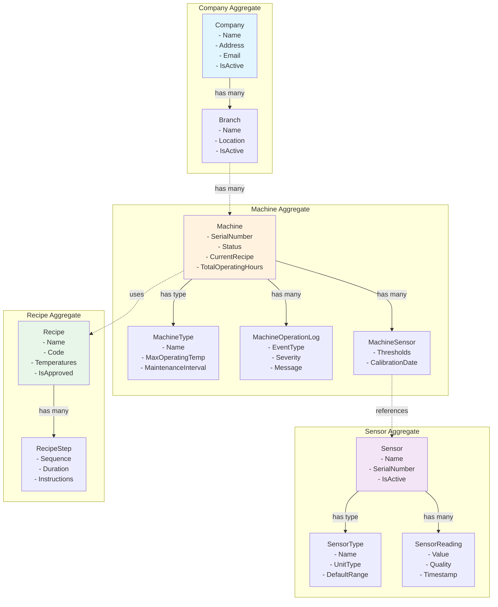
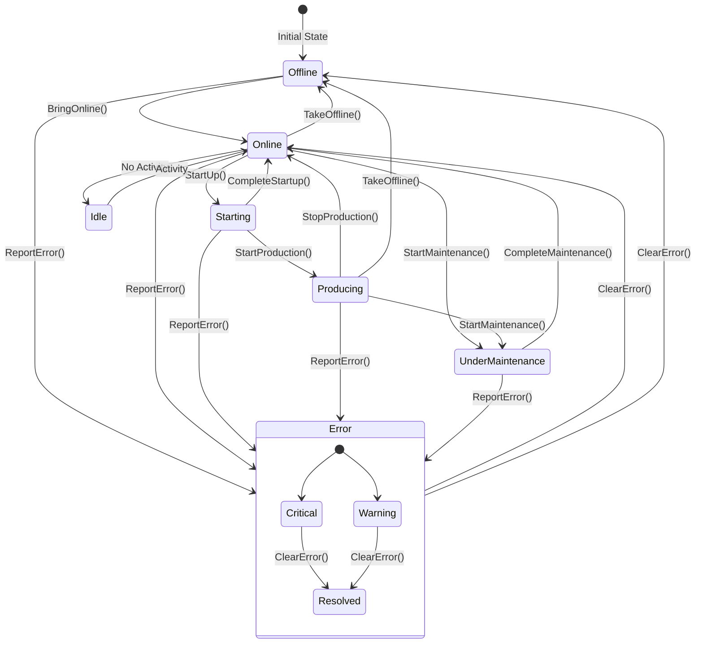
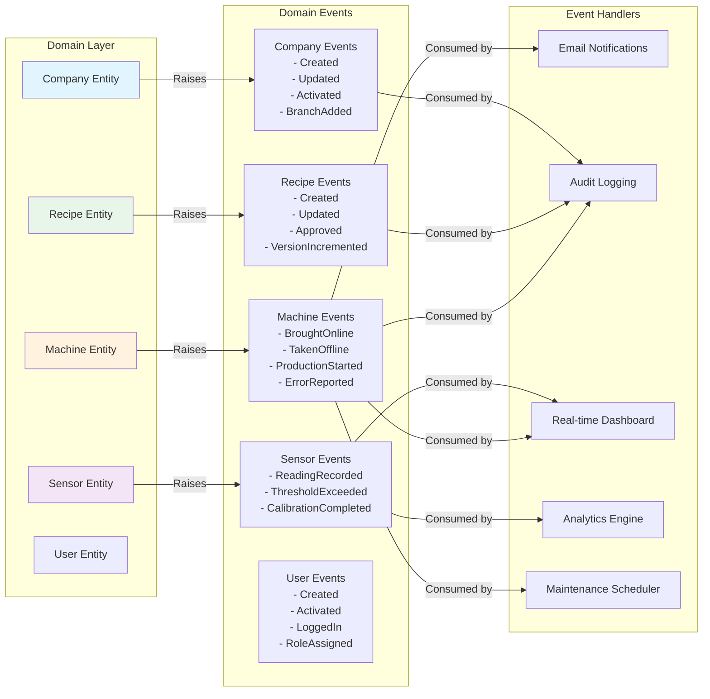
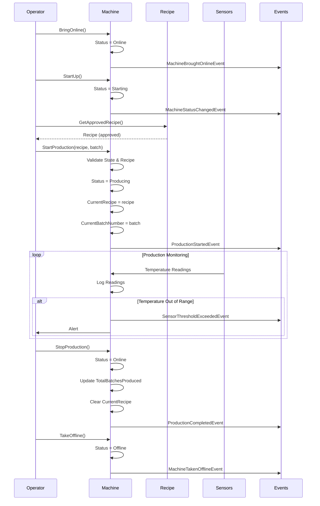
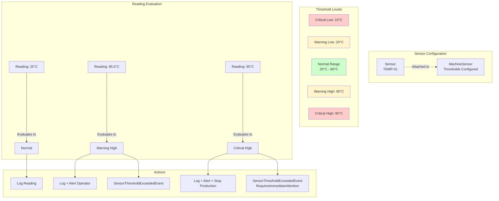
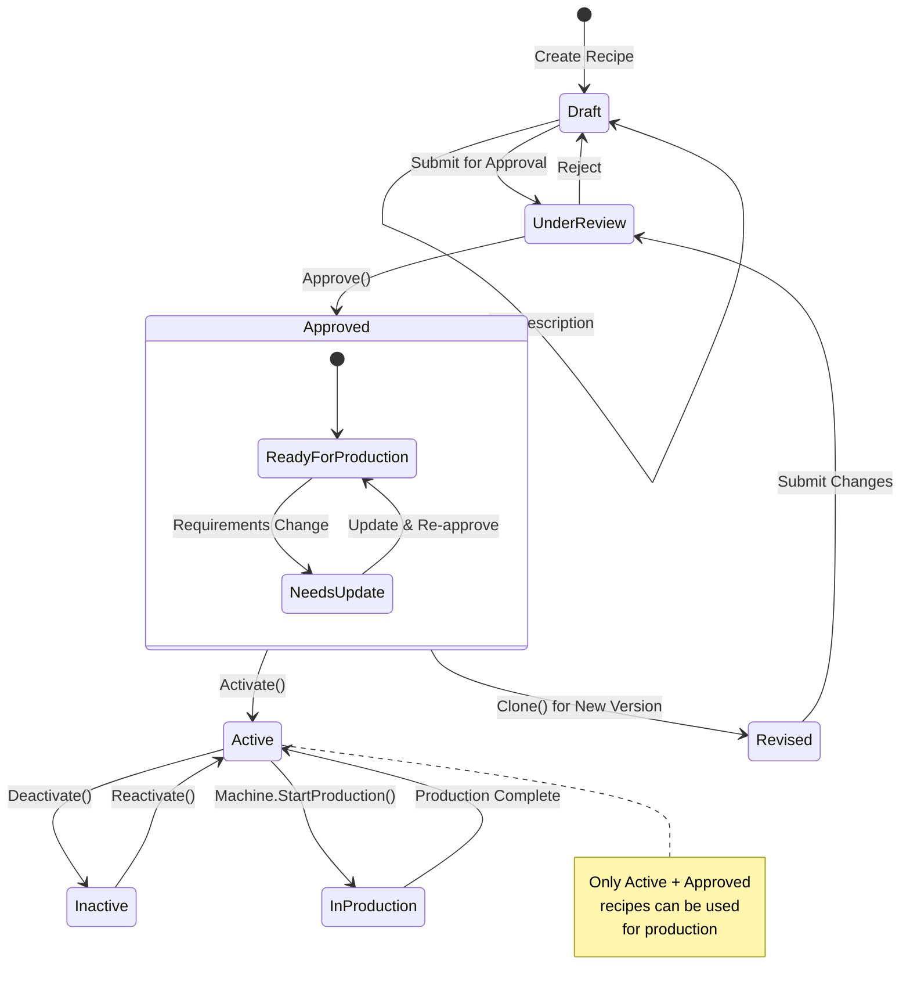

# NexusCore Domain Model

This document provides a comprehensive overview of the NexusCore domain model, including all entities, value objects, domain events, and exceptions.

## Domain Model Overview Diagram



## Table of Contents

- [Architecture Overview](#architecture-overview)
- [Domain Entities](#domain-entities)
  - [Companies](#companies)
  - [Users](#users)
  - [Machines](#machines)
  - [Sensors](#sensors)
  - [Recipes](#recipes)
- [Value Objects](#value-objects)
- [Domain Events](#domain-events)
- [Domain Exceptions](#domain-exceptions)
- [Key Patterns](#key-patterns)

## Architecture Overview

The NexusCore domain model follows Domain-Driven Design (DDD) principles with:

- **Rich Domain Model**: Entities encapsulate business logic and protect invariants
- **Aggregate Roots**: `Machine` and `Recipe` serve as aggregate roots managing their own consistency boundaries
- **Value Objects**: Immutable objects representing concepts without identity (e.g., `MachineStatus`, `Temperature`)
- **Domain Events**: Capture important business occurrences for integration and audit
- **Domain Exceptions**: Provide rich context for business rule violations

### Base Classes

- **BaseEntity**: Base class for all entities with `Guid` identifier
- **AggregateRoot**: Extends `BaseEntity` with domain event management capabilities
- **ValueObject**: Base class for value objects with value equality semantics
- **DomainEvent**: Base class for all domain events with metadata support
- **DomainException**: Base class for all domain exceptions with error codes

## Domain Entities

### Companies

#### Company Entity
**Location**: `Companies/Entities/Company.cs`

The root entity for company management with branches.

**Key Properties**:
- `Name`: Company name (required, max 200 chars)
- `Address`: Physical address (max 500 chars)
- `PhoneNumber`: Contact phone (max 50 chars)
- `Email`: Contact email (max 100 chars)
- `IsActive`: Whether company is operational
- `Branches`: Collection of associated branches

**Key Behaviors**:
- `SetName()`, `SetAddress()`, `SetPhoneNumber()`, `SetEmail()`: Update company details with validation
- `Activate()` / `Deactivate()`: Control operational status
- `AddBranch()` / `RemoveBranch()`: Manage branch relationships

**Business Rules**:
- Company name is required and must be unique
- Cannot deactivate company with active branches
- Email must be valid format if provided

#### Branch Entity
**Location**: `Companies/Entities/Branch.cs`

Represents a physical location of a company.

**Key Properties**:
- `Name`: Branch name (required)
- `Location`: Physical location
- `CompanyRef`: Reference to parent company
- `IsActive`: Operational status

**Key Behaviors**:
- `SetName()`, `SetLocation()`: Update branch details
- `Activate()` / `Deactivate()`: Control operational status
- `ChangeCompany()`: Transfer branch to different company

### Users

#### User Entity (Aggregate Root)
**Location**: `Users/Entities/User.cs`

The root entity for user management with authentication, roles, and audit capabilities.

**Key Properties**:
- `Username`: Unique username for authentication (3-50 chars, alphanumeric + _-)
- `Email`: User's email address (max 255 chars, validated format)
- `FullName`: User's full name (max 100 chars)
- `PhoneNumber`: Contact phone (max 20 chars)
- `Department`: Organizational unit (max 100 chars)
- `JobTitle`: Job title (max 100 chars)
- `EmployeeId`: Employee identifier (max 50 chars)
- `IsActive`: Whether account is active
- `IsLocked`: Whether account is locked
- `CreatedAt`: Account creation timestamp
- `LastModifiedAt`: Last modification timestamp
- `LastLoginAt`: Last successful login timestamp
- `FailedLoginAttempts`: Count of consecutive failed logins
- `ExpiresAt`: Account expiration date
- `Roles`: Collection of assigned user roles
- `Sessions`: Collection of active login sessions
- `AuditLogs`: Collection of audit log entries

**Key Behaviors**:

*Account Management*:
- `SetUsername()`, `SetEmail()`, `SetFullName()`: Update user details with validation
- `SetPhoneNumber()`, `SetDepartment()`, `SetJobTitle()`, `SetEmployeeId()`: Update optional details
- `Activate()`, `Deactivate()`: Control account status
- `Lock()`, `Unlock()`: Security controls
- `SetExpiration()`: Set account expiration date

*Authentication*:
- `RecordSuccessfulLogin()`: Track successful logins
- `RecordFailedLogin()`: Track failed attempts (auto-lock after 5 failures)
- `Logout()`: Terminate specific sessions
- `TerminateAllSessions()`: Force logout from all sessions

*Role Management*:
- `AddRole()`, `RemoveRole()`: Manage user roles
- `HasRole()`, `HasAnyRole()`, `HasAllRoles()`: Check permissions
- `CanPerformActions()`: Verify account usability

*Audit & Security*:
- `GetActiveSessionsCount()`: Monitor active sessions
- `IsExpired()`: Check account expiration
- `GetActiveSessionsCount()`: Session monitoring

**Business Rules**:
- Username must be unique and 3-50 characters
- Email must be valid format and unique
- Account auto-locks after 5 failed login attempts
- Expired accounts cannot perform actions
- All actions are logged for audit purposes

#### UserRole Entity
**Location**: `Users/Entities/UserRole.cs`

Represents a role assigned to a user with permissions and metadata.

**Key Properties**:
- `Role`: Role name (required)
- `Description`: Role description
- `AssignedAt`: When role was assigned
- `AssignedBy`: Who assigned the role
- `IsActive`: Whether role is active
- `ExpiresAt`: Role expiration date
- `Metadata`: Additional role metadata

**Key Behaviors**:
- `SetDescription()`, `SetExpiration()`: Update role details
- `Activate()`, `Deactivate()`: Control role status
- `IsExpired()`, `IsValid()`: Check role validity
- `AddMetadata()`, `RemoveMetadata()`, `GetMetadata()`: Manage metadata

#### UserSession Entity
**Location**: `Users/Entities/UserSession.cs`

Represents a user login session with tracking and security information.

**Key Properties**:
- `IpAddress`: IP address where session was created
- `UserAgent`: Browser/client user agent string
- `CreatedAt`: Session creation timestamp
- `LastAccessedAt`: Last session activity timestamp
- `ExpiresAt`: Session expiration timestamp
- `IsActive`: Whether session is active
- `SessionToken`: Hashed session token
- `RefreshToken`: Hashed refresh token
- `Metadata`: Additional session metadata

**Key Behaviors**:
- `Refresh()`: Extend session activity
- `Terminate()`: End session
- `IsExpired()`, `IsValid()`: Check session status
- `GetDuration()`, `GetTimeRemaining()`: Time tracking
- `ValidateToken()`, `ValidateRefreshToken()`: Security validation

#### UserAuditLog Entity
**Location**: `Users/Entities/UserAuditLog.cs`

Represents an audit log entry for user actions and changes.

**Key Properties**:
- `Message`: Audit message
- `Category`: Audit category
- `Action`: Action performed
- `PerformedBy`: Who performed the action
- `PerformedAt`: When action was performed
- `Details`: Additional action details
- `IpAddress`: IP address where action occurred
- `Severity`: Severity level of audit entry
- `Metadata`: Additional audit metadata

**Key Behaviors**:
- `SetSeverity()`, `SetDetails()`: Update audit details
- `IsHighSeverity()`: Check severity level
- `GetFormattedMessage()`: Get formatted audit message
- `GetAge()`, `IsOlderThan()`: Time-based queries

### Machines

#### Machine Entity (Aggregate Root)
**Location**: `Machines/Entities/Machine.cs`

Central aggregate for machine lifecycle and production management.

**Key Properties**:
- `SerialNumber`: Unique machine identifier
- `Status`: Current operational status (`MachineStatus` value object)
- `Name`: Display name
- `Model`: Machine model
- `Manufacturer`: Machine manufacturer
- `InstallationDate`: When machine was installed
- `CurrentRecipe`: Active recipe for production
- `CurrentBatchNumber`: Active production batch
- `TotalOperatingHours`: Cumulative operating time
- `TotalBatchesProduced`: Total production count
- `NextMaintenanceDate`: Scheduled maintenance

**Key Behaviors**:

*Lifecycle Management*:
- `BringOnline()`: Transition machine to online state
- `TakeOffline()`: Safely shutdown machine
- `MarkAsInstalled()`: Record installation completion
- `Deactivate()` / `Reactivate()`: Long-term status changes

*Production Control*:
- `StartProduction()`: Begin production with recipe and batch
- `StopProduction()`: End current production run
- `StartUp()` / `CompleteStartup()`: Startup sequence management

*Maintenance*:
- `StartMaintenance()` / `CompleteMaintenance()`: Maintenance workflow
- `IsMaintenanceDue()`: Check maintenance requirements

*Error Handling*:
- `ReportError()` / `ClearError()`: Error state management
- `GetRecentErrors()`: Retrieve error history

*Sensor Management*:
- `AddSensor()` / `RemoveSensor()`: Configure machine sensors
- `GetSensorsRequiringCalibration()`: Identify calibration needs

**State Machine**:
The machine follows strict state transitions:



#### MachineType Entity
**Location**: `Machines/Entities/MachineType.cs`

Defines machine categories and specifications.

**Key Properties**:
- `Name`: Type name
- `Description`: Detailed description
- `Manufacturer`: Original manufacturer
- `MaxOperatingTemp` / `MinOperatingTemp`: Temperature limits
- `MaintenanceIntervalHours`: Standard maintenance schedule
- `RequiredSensorTypes`: Mandatory sensors for this type

**Key Behaviors**:
- `RegisterMachine()` / `UnregisterMachine()`: Track machines of this type
- `GetMachinesRequiringMaintenance()`: Identify maintenance needs
- Factory methods for common types (e.g., `CreateInjectionMoldingType()`)

#### MachineOperationLog Entity
**Location**: `Machines/Entities/MachineOperationLog.cs`

Rich event log for machine operations with structured data.

**Key Properties**:
- `EventType`: Type of event (`EventTypeEnum`)
- `Severity`: Event severity level
- `Message`: Human-readable description
- `AdditionalData`: JSON-serialized event-specific data
- `IsAcknowledged`: Whether event has been reviewed

**Key Behaviors**:
- Factory methods: `CreateError()`, `CreateMaintenanceLog()`, `CreateProductionLog()`
- `Acknowledge()`: Mark event as reviewed
- `SetPumpErrorData()`, `SetRecipeData()`, `SetSensorData()`: Add structured data
- `RequiresImmediateAttention()`: Identify critical events

#### MachineSensor Entity
**Location**: `Machines/Entities/MachineSensor.cs`

Configuration for sensors attached to machines.

**Key Properties**:
- `MachineRef` / `SensorRef`: References to machine and sensor
- `WarningLowThreshold` / `WarningHighThreshold`: Warning limits
- `CriticalLowThreshold` / `CriticalHighThreshold`: Critical limits
- `LastCalibrationDate`: Calibration tracking
- `CalibrationIntervalDays`: Calibration schedule

**Key Behaviors**:
- `AddReading()`: Record new sensor reading
- `EvaluateReading()`: Assess reading against thresholds
- `MarkCalibrated()`: Update calibration status
- `IsCalibrationDue()`: Check calibration requirements
- `GetAverageReading()`: Calculate average over time period

### Sensors

#### Sensor Entity
**Location**: `Sensors/Entities/Sensor.cs`

Physical sensor device management.

**Key Properties**:
- `Name`: Sensor identifier
- `SensorTypeRef`: Reference to sensor type
- `Description`: Detailed description
- `Manufacturer` / `ModelNumber` / `SerialNumber`: Hardware details
- `CalibrationIntervalDays`: Calibration schedule
- `IsActive`: Operational status

**Key Behaviors**:
- `RecordReading()`: Add new reading with validation
- `MarkCalibrated()`: Update calibration status
- `GetLatestReading()`: Retrieve most recent reading
- `GetAverageReading()`: Calculate average over period
- `PurgeOldReadings()`: Clean up historical data

#### SensorReading Entity
**Location**: `Sensors/Entities/SensorReading.cs`

Individual sensor measurement record.

**Key Properties**:
- `Value`: Measured value
- `Quality`: Reading quality assessment (`ReadingQuality` enum)
- `IsProcessed`: Processing status
- `Notes`: Additional context

**Key Behaviors**:
- `MarkAsProcessed()`: Update processing status
- `UpdateQuality()`: Adjust quality assessment
- `IsWithinRange()`: Validate against expected range
- `IsStale()`: Check data freshness

#### SensorType Entity
**Location**: `Sensors/Entities/SensorType.cs`

Sensor category definitions and defaults.

**Key Properties**:
- `Name`: Type name
- `UnitType`: Measurement unit
- `DefaultMinValue` / `DefaultMaxValue`: Expected ranges
- `DefaultCalibrationIntervalDays`: Standard calibration schedule

**Key Behaviors**:
- `RegisterSensor()` / `UnregisterSensor()`: Track sensors of this type
- Factory methods: `CreateTemperatureSensorType()`, `CreateDigitalSensorType()`

### Recipes

#### Recipe Entity (Aggregate Root)
**Location**: `Recipes/Entities/Recipe.cs`

Production recipe management with version control.

**Key Properties**:
- `Name` / `Code`: Recipe identification
- `HeatingTemperature` / `CoolingTemperature` / `PouringTemperature`: Process temperatures
- `Description`: Detailed instructions
- `TemperatureTolerance`: Acceptable variance
- `EstimatedCycleTimeMinutes`: Expected duration
- `Version`: Version number
- `IsApproved` / `ApprovedBy` / `ApprovedAt`: Approval workflow

**Key Behaviors**:
- `AddStep()` / `RemoveStep()`: Manage recipe steps
- `Approve()` / `RevokeApproval()`: Approval workflow
- `Clone()`: Create new version
- `IsTemperatureWithinTolerance()`: Validate temperature readings
- `CanBeUsedForProduction()`: Check production readiness

**Inner Class - RecipeStep**:
Represents individual steps in a recipe with sequence, duration, and instructions.

## Value Objects

### MachineStatus
**Location**: `Machines/ValueObjects/MachineStatus.cs`

Immutable representation of machine operational states.

**Static Instances**:
- `Offline`: Machine powered down
- `Online`: Ready for operation
- `Starting`: Startup sequence in progress
- `Producing`: Active production
- `UnderMaintenance`: Maintenance mode
- `Error`: Error state
- `Idle`: Online but not producing

**Key Methods**:
- `CanTransitionTo()`: Validate state transitions
- `GetValidNextStates()`: Available transitions
- `CanStartProduction()`: Check production readiness

### Temperature
**Location**: `ValuesObject/Temperature.cs`

Temperature measurement with unit conversion.

**Features**:
- Supports Celsius, Fahrenheit, Kelvin
- Automatic conversion between units
- Validation of physically possible values
- Immutable with value equality

### Address
**Location**: `Companies/ValueObjects/Address.cs`

Structured address representation.

**Components**:
- Street, City, State, PostalCode, Country
- Format() method for display
- Validation of required fields

### UserRole
**Location**: `Users/ValueObjects/UserRole.cs`

Immutable representation of user roles with permissions and metadata.

**Predefined System Roles**:
- `SuperAdmin`: Full system access with all permissions
- `Admin`: Administrative access to most system functions
- `Manager`: Department oversight with production capabilities
- `Operator`: Machine operation and production control
- `Technician`: Maintenance and calibration access
- `Viewer`: Read-only access to system information
- `User`: Basic user with limited access

**Key Methods**:
- `HasPermission()`: Check specific permission
- `HasAnyPermission()`: Check for any of specified permissions
- `HasAllPermissions()`: Check for all specified permissions
- `CanManageRoles()`: Check if role can manage other roles
- `CanManageUsers()`: Check if role can manage users
- `IsAdministrative()`: Check if role has administrative access
- `IsReadOnly()`: Check if role is read-only

**Factory Methods**:
- `CreateCustom()`: Create custom role with specific permissions
- `Create()`: Create role with description and permissions
- `GetByName()`: Retrieve predefined role by name
- `GetAllSystemRoles()`: Get all available system roles

### Other Value Objects
- `DigitalState`: Binary state representation
- `EventData`: Base for structured event data
- `PumpEventData`: Pump-specific event information
- `MeasurementUnit`: Unit of measurement enumeration

## Domain Events

Domain events capture significant business occurrences and are organized by aggregate.



### Company Events

#### CompanyCreatedEvent
Raised when a new company is registered in the system.

**Properties**:
- `CompanyName`: Name of the created company
- `Address`, `PhoneNumber`, `Email`: Contact details
- `IsActive`: Initial status

#### CompanyUpdatedEvent
Raised when company details are modified.

**Properties**:
- `UpdatedProperties`: List of changed properties
- `UpdatedBy`: User who made changes
- Old and new values for each property

#### CompanyActivatedEvent / CompanyDeactivatedEvent
Track company status changes with reasons and affected branches.

#### BranchAddedEvent / BranchRemovedEvent
Track branch relationships with company.

### User Events

#### UserCreatedEvent
Raised when a new user account is created in the system.

**Properties**:
- `Username`, `Email`, `FullName`: User identification
- `CreatedBy`: Who created the account
- `IsActive`: Initial account status

#### UserActivatedEvent / UserDeactivatedEvent
Track user account status changes.

**Properties**:
- `Username`: User identification
- `ActivatedBy` / `DeactivatedBy`: Who performed the action
- `Reason`: Reason for deactivation (if applicable)

#### UserLoggedInEvent / UserLoggedOutEvent
Track user authentication activities.

**UserLoggedInEvent Properties**:
- `Username`: User identification
- `IpAddress`: IP address of login
- `UserAgent`: Browser/client information
- `LoginTime`: Timestamp of successful login

**UserLoggedOutEvent Properties**:
- `Username`: User identification
- `SessionId`: Terminated session identifier
- `Reason`: Reason for logout

#### UserLoginFailedEvent
Raised when user login attempts fail.

**Properties**:
- `Username`: User identification
- `Reason`: Failure reason
- `IpAddress`: IP address of failed attempt
- `FailedAttempts`: Consecutive failure count
- `Timestamp`: When the failure occurred

#### UserRoleAssignedEvent / UserRoleRemovedEvent
Track user role changes.

**Properties**:
- `Username`: User identification
- `Role`: Role name
- `AssignedBy` / `RemovedBy`: Who performed the action
- `Timestamp`: When the change occurred

### Machine Events

#### MachineBroughtOnlineEvent
Machine transitions to operational state.

**Properties**:
- `MachineId`, `SerialNumber`: Machine identification
- `PreviousStatus`: State before transition
- `Operator`: Who initiated the change
- `MachineTypeRef`, `BranchRef`: Relationships

#### MachineTakenOfflineEvent
Machine shutdown with reason tracking.

**Properties**:
- `Reason`: Why machine was taken offline
- `ProductionWasStopped`: If production was interrupted
- `TotalOperatingHours`: Cumulative runtime

#### ProductionStartedEvent / ProductionCompletedEvent
Track production lifecycle.

**ProductionStartedEvent Properties**:
- `RecipeId`, `RecipeName`, `RecipeCode`: Recipe details
- `BatchNumber`: Production batch identifier
- `EstimatedCompletionTime`: Expected end time
- `InitialTemperatures`: Starting conditions

**ProductionCompletedEvent Properties**:
- `BatchesProduced`: Quantity produced
- `Duration`: Actual production time
- `QualityStatus`: Production quality assessment
- `WasteProduced`: Waste quantity
- `FinalTemperatures`: Ending conditions

#### MaintenanceStartedEvent / MaintenanceCompletedEvent
Maintenance workflow tracking.

**Properties**:
- `MaintenanceType`: Scheduled/unscheduled
- `TechnicianName`: Who performed maintenance
- `TasksPerformed`: List of completed tasks
- `PartsReplaced`: Component changes
- `NextScheduledMaintenance`: Future schedule

#### MachineErrorReportedEvent / MachineErrorClearedEvent
Error state management.

**Properties**:
- `ErrorCode`, `ErrorMessage`: Error details
- `Severity`: Error criticality
- `AffectedComponents`: Impacted systems
- `ResolutionSteps`: How error was resolved

### Sensor Events

#### SensorReadingRecordedEvent
New sensor measurement captured.

**Properties**:
- `Value`: Measured value
- `UnitType`: Measurement unit
- `Quality`: Reading quality assessment
- `IsWithinNormalRange`: Threshold evaluation

#### SensorThresholdExceededEvent
Reading exceeds configured limits.

**Properties**:
- `ThresholdType`: Which limit was exceeded
- `ThresholdValue`: The limit value
- `ExceededBy`: Amount over limit
- `DurationBeyondThreshold`: Time outside limits
- `RequiresImmediateAttention`: Criticality flag
- `RecommendedAction`: Suggested response

#### SensorCalibrationCompletedEvent
Calibration performed on sensor.

**Properties**:
- `CalibratedBy`: Technician
- `CalibrationCertificate`: Documentation
- `OldCalibrationFactor` / `NewCalibrationFactor`: Adjustments
- `NextCalibrationDue`: Future schedule

#### SensorActivatedEvent / SensorDeactivatedEvent
Sensor status changes with reasons.

#### SensorAddedToMachineEvent
Sensor configuration on machine.

**Properties**:
- Complete threshold configuration
- Installation details
- Initial calibration status

### Recipe Events

#### RecipeCreatedEvent
New recipe added to system.

**Properties**:
- `Code`, `Name`: Recipe identification
- Temperature parameters
- `Version`: Initial version (typically 1)
- `IsActive`: Initial status

#### RecipeUpdatedEvent
Recipe modifications tracked.

**Properties**:
- `ChangedProperties`: What was modified
- `ChangeReason`: Why changes were made
- `NewVersion`: Updated version number

#### RecipeApprovedEvent / RecipeApprovalRevokedEvent
Approval workflow tracking.

**Properties**:
- `ApprovedBy` / `RevokedBy`: Who changed approval
- `ApprovalNotes` / `RevocationReason`: Context
- `Version`: Which version was affected

#### RecipeVersionIncrementedEvent
New recipe version created.

**Properties**:
- `OldVersion` / `NewVersion`: Version transition
- `ChangesSummary`: What changed
- `IsBackwardCompatible`: Compatibility flag

#### RecipeStepAddedEvent / RecipeStepRemovedEvent
Recipe step modifications.

**Properties**:
- Complete step details
- Position in sequence
- Impact on cycle time

## Domain Exceptions

Domain exceptions provide rich context for business rule violations.

```mermaid
graph TD
    DE[DomainException<br/>- ErrorCode<br/>- Details<br/>- OccurredAt]
    
    DE --> CE[Common Exceptions]
    DE --> CompE[Company Exceptions]
    DE --> UE[User Exceptions]
    DE --> ME[Machine Exceptions]
    DE --> SE[Sensor Exceptions]
    DE --> RE[Recipe Exceptions]
    
    CE --> ENF[EntityNotFoundException]
    CE --> CONC[ConcurrencyException]
    CE --> DV[DomainValidationException]
    
    CompE --> ICN[InvalidCompanyNameException]
    CompE --> CI[CompanyInactiveException]
    CompE --> CHAB[CompanyHasActiveBranchesException]
    
    UE --> IUN[InvalidUsernameException]
    UE --> IEM[InvalidEmailException]
    UE --> IFN[InvalidFullNameException]
    UE --> IPN[InvalidPhoneNumberException]
    UE --> IDE[InvalidDepartmentException]
    UE --> IJT[InvalidJobTitleException]
    UE --> IEI[InvalidEmployeeIdException]
    UE --> IED[InvalidExpirationDateException]
    UE --> UAE[UserAccountException]
    
    ME --> IMS[InvalidMachineStateException]
    ME --> MMO[MachineMaintenanceOverdueException]
    ME --> PIP[ProductionInProgressException]
    ME --> MSL[MachineSensorLimitExceededException]
    
    SE --> ISR[InvalidSensorReadingException]
    SE --> SCR[SensorCalibrationRequiredException]
    SE --> SI[SensorInactiveException]
    
    RE --> RNA[RecipeNotApprovedException]
    RE --> IRT[InvalidRecipeTemperatureException]
    RE --> RSN[RecipeStepNotFoundException]
    RE --> DRS[DuplicateRecipeStepException]
    
    style DE fill:#ffebee
    style CE fill:#fce4ec
    style CompE fill:#f3e5f5
    style ME fill:#ede7f6
    style SE fill:#e8eaf6
    style RE fill:#e3f2fd
```



### Base Exception

#### DomainException
**Location**: `Common/DomainException.cs`

Base class for all domain exceptions.

**Features**:
- `ErrorCode`: Unique error identifier
- `Details`: Key-value pairs for context
- `OccurredAt`: Timestamp
- Fluent API for adding details

### Common Exceptions

#### EntityNotFoundException
Entity lookup failed.

**Properties**:
- `EntityType`: What type of entity
- `EntityId`: Identifier used
- `SearchCriteria`: How search was performed

#### ConcurrencyException
Concurrent modification detected.

**Properties**:
- `ExpectedVersion` / `ActualVersion`: Version mismatch
- Suggested retry strategies

#### DomainValidationException
General validation failure with multiple errors.

**Properties**:
- `ValidationErrors`: Collection of field-level errors
- `GetErrorsForProperty()`: Retrieve specific field errors

### Company Exceptions

#### InvalidCompanyNameException
Company name validation failed.

**Reasons**:
- Empty or whitespace only
- Exceeds maximum length
- Contains invalid characters
- Already exists (duplicate)

#### CompanyInactiveException
Operation attempted on inactive company.

#### CompanyHasActiveBranchesException
Cannot deactivate company with active branches.

### User Exceptions

#### InvalidUsernameException
Username validation failed.

**Reasons**:
- Empty or whitespace only
- Too short (less than 3 characters)
- Too long (more than 50 characters)
- Contains invalid characters
- Already exists (duplicate)

**Factory Methods**:
- `Empty()`: Username is empty
- `TooShort()`: Username is too short
- `TooLong()`: Username is too long
- `InvalidCharacters()`: Username contains invalid characters
- `Duplicate()`: Username already exists

#### InvalidEmailException
Email address validation failed.

**Reasons**:
- Empty or whitespace only
- Too long (more than 255 characters)
- Invalid email format
- Already exists (duplicate)

**Factory Methods**:
- `Empty()`: Email is empty
- `TooLong()`: Email is too long
- `InvalidFormat()`: Email format is invalid
- `Duplicate()`: Email already exists

#### InvalidFullNameException
Full name validation failed.

**Reasons**:
- Empty or whitespace only
- Too long (more than 100 characters)
- Contains invalid characters

**Factory Methods**:
- `Empty()`: Full name is empty
- `TooLong()`: Full name is too long
- `InvalidCharacters()`: Full name contains invalid characters

#### InvalidPhoneNumberException
Phone number validation failed.

**Reasons**:
- Too long (more than 20 characters)
- Invalid format

**Factory Methods**:
- `TooLong()`: Phone number is too long
- `InvalidFormat()`: Phone number format is invalid

#### InvalidDepartmentException
Department name validation failed.

**Reasons**:
- Too long (more than 100 characters)

**Factory Methods**:
- `TooLong()`: Department name is too long

#### InvalidJobTitleException
Job title validation failed.

**Reasons**:
- Too long (more than 100 characters)

**Factory Methods**:
- `TooLong()`: Job title is too long

#### InvalidEmployeeIdException
Employee ID validation failed.

**Reasons**:
- Too long (more than 50 characters)
- Already exists (duplicate)

**Factory Methods**:
- `TooLong()`: Employee ID is too long
- `Duplicate()`: Employee ID already exists

#### InvalidExpirationDateException
Account expiration date validation failed.

**Reasons**:
- Date is in the past
- Date is too soon (insufficient notice)

**Factory Methods**:
- `InThePast()`: Expiration date is in the past
- `TooSoon()`: Expiration date is too soon

#### UserAccountException
User account operation failed.

**Reasons**:
- Account is inactive
- Account is locked
- Account has expired
- Insufficient permissions

**Factory Methods**:
- `AccountInactive()`: Account is inactive
- `AccountLocked()`: Account is locked
- `AccountExpired()`: Account has expired
- `InsufficientPermissions()`: User lacks required permissions

### Machine Exceptions

#### InvalidMachineStateException
Invalid state transition attempted.

**Properties**:
- `CurrentState`: Machine's current state
- `AttemptedOperation`: What was attempted
- `ValidStates`: Which states would allow operation

#### MachineMaintenanceOverdueException
Machine requires maintenance before operation.

**Properties**:
- `DaysOverdue`: How late maintenance is
- `LastMaintenanceDate`: When last serviced
- `BlockedOperations`: What cannot be done

#### ProductionInProgressException
Operation blocked by active production.

**Properties**:
- `CurrentBatchNumber`: Active batch
- `CurrentRecipe`: What's being produced
- `ProductionStartTime`: When started

#### MachineSensorLimitExceededException
Too many sensors configured.

**Properties**:
- `CurrentCount` / `MaximumAllowed`: Limits
- `AttemptedSensorType`: What was being added

### Sensor Exceptions

#### InvalidSensorReadingException
Reading validation failed.

**Properties**:
- `AttemptedValue`: The invalid reading
- `ExpectedRange`: Valid min/max
- `ValidationRule`: Specific rule violated

**Factory Methods**:
- `OutOfRange()`: Value exceeds limits
- `InvalidQuality()`: Quality too poor
- `InvalidUnit()`: Wrong measurement unit

#### SensorCalibrationRequiredException
Sensor needs calibration before use.

**Properties**:
- `DaysOverdue`: How late calibration is
- `LastCalibrationDate`: When last calibrated
- `RequiredInterval`: Expected schedule

#### SensorInactiveException
Operation on inactive sensor.

### Recipe Exceptions

#### RecipeNotApprovedException
Unapproved recipe used for production.

**Properties**:
- `RequiresApprovalFrom`: Who can approve
- `LastModifiedDate`: When changed

#### InvalidRecipeTemperatureException
Temperature validation failed.

**Properties**:
- `TemperatureType`: Which temperature (heating/cooling/pouring)
- `Value`: Invalid value
- `MinimumAllowed` / `MaximumAllowed`: Valid range
- `ValidationRule`: Specific rule violated

**Factory Methods**:
- `OutOfRange()`: Temperature outside limits
- `InvalidSequence()`: Temperature progression invalid

#### RecipeStepNotFoundException
Referenced step doesn't exist.

#### DuplicateRecipeStepException
Step number already used.

## Key Patterns

### 1. Encapsulation
All entities use private setters with public methods for modifications, ensuring:
- Validation of all inputs
- Business rule enforcement
- Consistent state transitions

### 2. Factory Methods
Complex objects use factory methods for common scenarios:
```csharp
var log = MachineOperationLog.CreateError(machine, "Pump failure", 
    EventTypeEnum.PumpError, SeverityLevelEnum.Critical, "System");
```

### 3. Value Objects
Immutable objects for concepts without identity:
```csharp
var status = MachineStatus.Online;
if (status.CanTransitionTo(MachineStatus.Producing)) 
{
    // Valid transition
}
```

### 4. Domain Events
All significant changes raise events:
```csharp
// In Machine.StartProduction()
var @event = new ProductionStartedEvent(...);
AddDomainEvent(@event);
```

### 5. Rich Exceptions
Exceptions provide context and guidance:
```csharp
throw InvalidMachineStateException.ForOperation(
    machineId, currentState, "StartProduction", 
    MachineStatus.Online, MachineStatus.Idle);
```

### 6. Aggregate Boundaries
- `Machine` aggregate includes `MachineOperationLog` and `MachineSensor`
- `Recipe` aggregate includes `RecipeStep`
- `User` aggregate includes `UserRole`, `UserSession`, and `UserAuditLog`
- `Company` and `Branch` are separate aggregates with references

### 7. State Machine Pattern
Machine status transitions follow defined rules:
```csharp
Offline → Online → Starting → Producing
                ↓           ↓
          UnderMaintenance ← 
```

### 8. Role-Based Access Control (RBAC)
User permissions managed through roles:
```csharp
var user = new User("john.doe", "john@acme.com", "John Doe", "admin");
user.AddRole(UserRole.Operator, "admin");

if (user.HasRole("Operator") && user.CanPerformActions())
{
    // User can operate machines
}
```

### 9. Audit Trail Pattern
All user actions logged for compliance:
```csharp
// Automatic audit logging in User methods
user.SetEmail("newemail@acme.com");
// Creates UserAuditLog entry automatically
```

### 10. Session Management
Secure user sessions with automatic cleanup:
```csharp
user.RecordSuccessfulLogin("192.168.1.100", "Chrome/91.0");
// Creates UserSession with tokens
// Auto-lock after failed attempts
```

## Usage Examples

### Creating a Company with Branch
```csharp
var company = new Company("ACME Corp", "123 Main St", "+1234567890", "info@acme.com");
var branch = new Branch("Main Factory", "Industrial Zone", company.Id);
company.AddBranch(branch);
```

### User Management and Authentication
```csharp
// Create user with roles
var admin = new User("admin", "admin@acme.com", "System Administrator", "system");
admin.AddRole(UserRole.Admin, "system");

// Create operator user
var operator = new User("john.operator", "john@acme.com", "John Operator", "admin");
operator.AddRole(UserRole.Operator, "admin");
operator.SetDepartment("Production");
operator.SetJobTitle("Machine Operator");

// User authentication workflow
operator.RecordSuccessfulLogin("192.168.1.100", "Chrome/91.0");
// Creates session, resets failed attempts

// Role-based permission checking
if (operator.HasRole("Operator") && operator.CanPerformActions())
{
    // User can operate machines
    machine.StartProduction(recipe, "BATCH-001", operator.Username);
}

// Account management
admin.Lock(operator.Username, "Suspicious activity detected", "admin");
// Terminates all sessions, prevents login

// Audit trail
var auditLogs = operator.AuditLogs;
// All actions automatically logged
```

### Machine Production Workflow



```csharp
// Bring machine online
machine.BringOnline("operator@example.com");

// Start production
var recipe = GetApprovedRecipe();
machine.StartProduction(recipe, "BATCH-2024-001", "operator@example.com");

// Machine automatically tracks operating hours, logs events

// Complete production
var result = machine.StopProduction("operator@example.com", "Production completed");
```

### Sensor Monitoring



```csharp
// Configure sensor on machine
var sensor = new Sensor("TEMP-01", temperatureSensorType.Id);
var machineSensor = new MachineSensor(machine.Id, sensor.Id)
    .SetWarningThresholds(20, 80)
    .SetCriticalThresholds(10, 90);

// Record reading
sensor.RecordReading(85.5m, ReadingQuality.Good);

// Evaluate reading
var status = machineSensor.EvaluateReading(85.5m);
if (status == ThresholdStatus.WarningHigh) 
{
    // Handle warning
}
```

### Recipe Management



```csharp
// Create recipe
var recipe = new Recipe("Plastic Cup", "PC-001", 180, 25, 160);
recipe.AddStep(1, "Heat material", 300, "Heat to 180°C");
recipe.AddStep(2, "Inject", 45, "Inject into mold");
recipe.AddStep(3, "Cool", 120, "Cool to 25°C");

// Approve for production
recipe.Approve("qa@example.com", "Passed quality checks");
```

## Best Practices

1. **Always use entity methods** rather than setting properties directly
2. **Check state before operations** using provided query methods
3. **Handle domain exceptions** appropriately at application boundaries
4. **Subscribe to domain events** for integration and notifications
5. **Respect aggregate boundaries** - don't bypass them
6. **Use value objects** for concepts without identity
7. **Validate early** using domain exceptions for clear error messages

## Future Considerations

- Event Sourcing: Domain events are structured to support future event sourcing
- CQRS: Aggregate roots are designed to work with command/query separation
- Multi-tenancy: Entity design supports tenant isolation
- Auditing: All modifications raise events for audit trails
