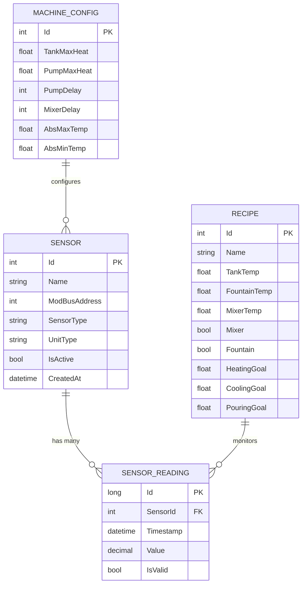

# 🚀 NexusCore - Industrial IoT Sensor Management Platform

[](https://dotnet.microsoft.com/download/dotnet/8.0)
[](https://docs.microsoft.com/en-us/ef/core/)
[](https://modbus.org/)
[](LICENSE)
[](https://github.com/yourusername/NexusCore/actions)

> **Enterprise-grade sensor monitoring and control system for industrial chocolate production machines**

## 📖 Table of Contents

- [Overview](#-overview)
- [✨ Key Features](#-key-features)
- [🏗️ System Architecture](#️-system-architecture)
- [🔌 Sensor System](#-sensor-system)
- [💾 Database Design](#-database-design)
- [🚀 Getting Started](#-getting-started)
- [📚 API Documentation](#-api-documentation)
- [⚙️ Configuration](#️-configuration)
- [🧪 Testing](#-testing)
- [📊 Performance & Monitoring](#-performance--monitoring)
- [🔧 Troubleshooting](#-troubleshooting)
- [🤝 Contributing](#-contributing)
- [📄 License](#-license)

## 🌟 Overview

**NexusCore** is a sophisticated, enterprise-grade sensor monitoring and control system designed specifically for industrial chocolate production environments. Built with modern .NET 8 architecture, it provides real-time monitoring, data analytics, and automated control capabilities for complex manufacturing processes.

### 🎯 What NexusCore Solves

- **Real-time Monitoring**: Live sensor data with sub-second response times
- **Quality Control**: Precise temperature management for chocolate tempering
- **Safety Management**: Automated safety interlocks and emergency controls
- **Data Analytics**: Historical trends and performance optimization
- **Industrial Integration**: Seamless ModBus RTU communication with PLC systems

### 🏭 Target Industries

- **Chocolate Production**: Tempering, molding, and packaging
- **Food Manufacturing**: Temperature-sensitive production processes
- **Chemical Processing**: Precise temperature and pressure control
- **Pharmaceutical**: Quality-critical manufacturing environments

## ✨ Key Features

### 🔥 Advanced Temperature Management
- **4-Point Temperature Monitoring**: Tank bottom, wall, pump, and fountain
- **PID Control System**: Intelligent heating/cooling with configurable parameters
- **Range Validation**: -14°C to 65°C with configurable thresholds
- **Thermal Mapping**: Multi-point temperature analysis for quality control

### 🛡️ Safety & Control Systems
- **3 Digital Sensors**: Pedal control, cover interlock, emergency stop
- **Safety Interlocks**: Automated shutdown on critical failures
- **Manual Override**: Operator control with safety validation
- **Audit Logging**: Complete operational history for compliance

### 📊 Real-Time Analytics
- **Live Dashboard**: Sub-second updates with visual indicators
- **Historical Trends**: Time-series analysis and reporting
- **Alert Management**: Configurable thresholds and notifications
- **Performance Metrics**: System health and efficiency monitoring

### 🔌 Industrial Integration
- **ModBus RTU Protocol**: Industry-standard communication
- **PLC Integration**: Seamless connection with existing systems
- **Multi-Protocol Support**: Extensible architecture for various protocols
- **Real-Time Communication**: SignalR for live updates

## 🏗️ System Architecture

```
┌─────────────────────────────────────────────────────────────────┐
│                    NexusCore Application                        │
├─────────────────────────────────────────────────────────────────┤
│  ┌─────────────┐  ┌─────────────┐  ┌─────────────┐           │
│  │   Web API   │  │  Dashboard  │  │ Background  │           │
│  │             │  │             │  │  Services   │           │
│  └─────────────┘  └─────────────┘  └─────────────┘           │
├─────────────────────────────────────────────────────────────────┤
│                    Business Logic Layer                        │
│  ┌─────────────┐  ┌─────────────┐  ┌─────────────┐           │
│  │Sensor Service│  │Recipe Engine│  │Control Logic│           │
│  └─────────────┘  └─────────────┘  └─────────────┘           │
├─────────────────────────────────────────────────────────────────┤
│                    Data Access Layer                           │
│  ┌─────────────┐  ┌─────────────┐  ┌─────────────┐           │
│  │ Entity      │  │ Repository  │  │ ModBus      │           │
│  │ Framework   │  │ Pattern     │  │ Service     │           │
│  └─────────────┘  └─────────────┘  └─────────────┘           │
├─────────────────────────────────────────────────────────────────┤
│                    Infrastructure Layer                        │
│  ┌─────────────┐  ┌─────────────┐  ┌─────────────┐           │
│  │ SQL Server  │  │   RabbitMQ  │  │   SignalR   │           │
│  │  Database   │  │  Message    │  │ Real-time   │           │
│  └─────────────┘  │   Broker    │  │  Updates    │           │
│                   └─────────────┘  └─────────────┘           │
└─────────────────────────────────────────────────────────────────┘
                                │
                                ▼
┌─────────────────────────────────────────────────────────────────┐
│                    Industrial Hardware                          │
│  ┌─────────────┐  ┌─────────────┐  ┌─────────────┐           │
│  │   PLC       │  ┌─────────────┐  │   Sensors   │           │
│  │ Controller  │◄─┤ ModBus RTU  ├─►│             │           │
│  └─────────────┘  │  Protocol   │  │ T1-T4, D1-D3│           │
│                   └─────────────┘  └─────────────┘           │
└─────────────────────────────────────────────────────────────────┘
```

## 🔌 Sensor System

### 🌡️ Temperature Sensors (4 units)

| Sensor | Name | ModBus Address | Range | Purpose | Status |
|--------|------|----------------|-------|---------|---------|
| **T-1** | Tank Bottom Temp | `8` | -14°C to 65°C | Monitor chocolate temperature at tank bottom | ✅ Active |
| **T-2** | Tank Wall Temp | `9` | -14°C to 65°C | Monitor chocolate temperature at tank wall | ✅ Active |
| **T-3** | Pump Temp | `10` | -10°C to 50°C | Monitor pump/circulation temperature | ✅ Active |
| **T-4** | Fountain Temp | `11` | -14°C to 65°C | Monitor dispensing temperature | ✅ Active |

### 🔌 Digital Sensors (3 units)

| Sensor | Name | ModBus Address | Type | Purpose | Status |
|--------|------|----------------|------|---------|---------|
| **D-1** | Pedal | `1 (Bit 0)` | Boolean | Manual dispensing control | ✅ Active |
| **D-2** | Cover Sensor | `1 (Bit 1)` | Boolean | Safety interlock for cover | ✅ Active |
| **D-3** | E-Stop | `1 (Bit 2)` | Boolean | Emergency stop button | ✅ Active |

### 📡 ModBus Configuration

```json
{
  "ModBusSettings": {
    "PortName": "COM1",
    "BaudRate": 115200,
    "DataBits": 8,
    "Parity": "None",
    "StopBits": 1,
    "SlaveAddress": 1,
    "Timeout": 1000,
    "PollingInterval": 30000
  }
}
```

## 💾 Database Design

### 🗄️ Entity Relationship



### 📊 Database Schema

```sql
-- Sensors table (static information)
CREATE TABLE Sensors (
    Id INT PRIMARY KEY IDENTITY(1,1),
    SensorType INT NOT NULL,
    Name NVARCHAR(100) NOT NULL,
    ModBusAddress INT NOT NULL,
    UnitType INT NOT NULL,
    IsActive BIT DEFAULT 1,
    CreatedAt DATETIME2 DEFAULT GETUTCDATE()
);

-- SensorReadings table (time-series data)
CREATE TABLE SensorReadings (
    Id BIGINT PRIMARY KEY IDENTITY(1,1),
    SensorId INT NOT NULL,
    Timestamp DATETIME2 NOT NULL,
    Value DECIMAL(10,2) NOT NULL,
    IsValid BIT DEFAULT 1,
    FOREIGN KEY (SensorId) REFERENCES Sensors(Id)
);

-- Performance indexes
CREATE INDEX IX_SensorReadings_SensorId_Timestamp 
ON SensorReadings(SensorId, Timestamp DESC);

CREATE UNIQUE INDEX IX_Sensors_ModBusAddress 
ON Sensors(ModBusAddress);
```

## 🚀 Getting Started

### 📋 Prerequisites

- **.NET 8.0 SDK** or later
- **SQL Server 2019** or later (or SQL Server Express)
- **Visual Studio 2022** or **VS Code**
- **ModBus RTU compatible hardware**

### 🔧 Installation

1. **Clone the repository**
   ```bash
   git clone https://github.com/yourusername/NexusCore.git
   cd NexusCore
   ```

2. **Restore dependencies**
   ```bash
   dotnet restore
   ```

3. **Configure database connection**
   ```json
   // appsettings.json
   {
     "ConnectionStrings": {
       "DefaultConnection": "Server=(localdb)\\mssqllocaldb;Database=NexusCore;Trusted_Connection=true;MultipleActiveResultSets=true"
     }
   }
   ```

4. **Run database migrations**
   ```bash
   dotnet ef database update
   ```

5. **Start the application**
   ```bash
   dotnet run
   ```

### 🎯 Quick Start Example

```csharp
// Initialize sensor service
var sensorService = new SensorService(context, modbusService);

// Register a new sensor
var sensor = await sensorService.RegisterSensorAsync(
    "Tank Bottom Temperature",
    SensorTypeEnum.TankBottomTemp,
    8
);

// Record a temperature reading
var reading = await sensorService.RecordReadingAsync(
    sensor.Id, 
    45.5m
);

// Get current status
var status = await sensorService.GetCurrentStatusAsync(sensor.Id);
Console.WriteLine($"Current temperature: {status.CurrentValue}°C");
```

## 📚 API Documentation

### 🔌 Sensor Endpoints

#### Get Sensor Status
```http
GET /api/sensors/{id}/status
```

**Response:**
```json
{
  "sensorId": 1,
  "name": "Tank Bottom Temperature",
  "currentValue": 45.5,
  "unit": "°C",
  "lastUpdate": "2024-01-15T10:00:00Z",
  "isOnline": true,
  "status": "Normal"
}
```

#### Get Historical Readings
```http
GET /api/sensors/{id}/readings?from=2024-01-01&to=2024-01-15
```

#### Record New Reading
```http
POST /api/sensors/{id}/readings
Content-Type: application/json

{
  "value": 45.5,
  "timestamp": "2024-01-15T10:00:00Z"
}
```

### 🎛️ Control Endpoints

#### Set Temperature Target
```http
POST /api/control/temperature
Content-Type: application/json

{
  "sensorId": 1,
  "targetValue": 47.0,
  "mode": "Auto"
}
```

#### Emergency Stop
```http
POST /api/control/emergency-stop
```

## ⚙️ Configuration

### 🔧 Application Settings

```json
{
  "NexusCore": {
    "SensorPollingInterval": 30000,
    "DataRetentionDays": 30,
    "AlertThresholds": {
      "TemperatureHigh": 60,
      "TemperatureLow": -10,
      "ResponseTimeout": 5000
    },
    "Localization": {
      "DefaultLanguage": "en",
      "SupportedLanguages": ["en", "ar"]
    }
  }
}
```

### 🌍 Localization Support

```csharp
// English
"Temperature": "Temperature",
"Current Value": "Current Value",
"Status": "Status"

// Arabic
"Temperature": "درجة الحرارة",
"Current Value": "القيمة الحالية",
"Status": "الحالة"
```

## 🧪 Testing

### 🧪 Unit Tests

```bash
# Run all tests
dotnet test

# Run specific test project
dotnet test NexusCore.Tests

# Run with coverage
dotnet test --collect:"XPlat Code Coverage"
```

### 🧪 Integration Tests

```bash
# Run integration tests
dotnet test NexusCore.IntegrationTests

# Run with test database
dotnet test --environment Testing
```

### 🧪 Test Examples

```csharp
[TestClass]
public class SensorServiceTests
{
    [TestMethod]
    public async Task RecordReading_ValidTemperature_SavesSuccessfully()
    {
        // Arrange
        var context = GetInMemoryContext();
        var service = new SensorService(context, null);
        var sensor = new Sensor 
        { 
            Id = 1, 
            SensorType = SensorTypeEnum.TankBottomTemp,
            UnitType = MeasurementUnitType.Temperature 
        };
        context.Sensors.Add(sensor);
        await context.SaveChangesAsync();
        
        // Act
        var reading = await service.RecordReadingAsync(1, 45.5m);
        
        // Assert
        Assert.IsNotNull(reading);
        Assert.AreEqual(45.5m, reading.Value);
        Assert.AreEqual(1, await context.SensorReadings.CountAsync());
    }
}
```

## 📊 Performance & Monitoring

### 🚀 Performance Optimization

- **Async Operations**: Non-blocking I/O for responsiveness
- **Bulk Operations**: Efficient data processing for high-frequency sensors
- **Database Indexing**: Optimized queries for time-series data
- **Memory Management**: Efficient data structures and caching

### 📈 Monitoring Features

- **Real-time Metrics**: Live performance indicators
- **Historical Analysis**: Trend analysis and reporting
- **Alert System**: Configurable notifications for critical events
- **Health Checks**: System status monitoring

### 🔍 Data Retention Policy

```csharp
// Clean up old readings periodically
public async Task CleanupOldReadingsAsync(int daysToKeep = 30)
{
    var cutoffDate = DateTime.UtcNow.AddDays(-daysToKeep);
    
    await _context.SensorReadings
        .Where(r => r.Timestamp < cutoffDate)
        .ExecuteDeleteAsync();
}
```

## 🔧 Troubleshooting

### ❌ Common Issues

#### 1. ModBus Communication Errors
**Symptoms:**
- Connection timeouts
- Invalid data readings
- Communication failures

**Solutions:**
- Check cable connections
- Verify baud rate settings
- Ensure correct slave address
- Test with ModBus simulator

#### 2. Invalid Temperature Readings
**Symptoms:**
- Out-of-range values
- Inconsistent readings
- Sensor offline status

**Solutions:**
- Verify sensor wiring
- Check for electromagnetic interference
- Calibrate sensors if needed
- Validate sensor configuration

#### 3. Database Performance Issues
**Symptoms:**
- Slow query responses
- High memory usage
- Connection timeouts

**Solutions:**
- Ensure indexes are created
- Implement data retention policy
- Consider partitioning for large datasets
- Monitor query performance

### 🐛 Debug Logging

```csharp
public class SensorLogger
{
    private readonly ILogger<SensorLogger> _logger;
    
    public void LogReading(int sensorId, decimal value, bool isValid)
    {
        if (!isValid)
        {
            _logger.LogWarning(
                "Invalid reading from sensor {SensorId}: {Value}", 
                sensorId, value);
        }
        else
        {
            _logger.LogDebug(
                "Sensor {SensorId} reading: {Value}", 
                sensorId, value);
        }
    }
}
```

### 📋 Troubleshooting Checklist

- [ ] ModBus connection established
- [ ] Sensor addresses configured correctly
- [ ] Database connection working
- [ ] All services running
- [ ] Logs showing normal operation
- [ ] Sensor readings within expected ranges

## 🤝 Contributing

We welcome contributions from the community! Here's how you can help:

### 🚀 Getting Started

1. **Fork the repository**
2. **Create a feature branch**
   ```bash
   git checkout -b feature/amazing-feature
   ```
3. **Make your changes**
4. **Add tests for new functionality**
5. **Commit your changes**
   ```bash
   git commit -m "Add amazing feature"
   ```
6. **Push to the branch**
   ```bash
   git push origin feature/amazing-feature
   ```
7. **Open a Pull Request**

### 📝 Development Guidelines

- **Code Style**: Follow C# coding conventions
- **Testing**: Maintain >80% code coverage
- **Documentation**: Update README and API docs
- **Performance**: Consider performance implications
- **Security**: Follow security best practices

### 🐛 Reporting Issues

When reporting issues, please include:

- **Description**: Clear description of the problem
- **Steps to Reproduce**: Detailed reproduction steps
- **Expected Behavior**: What you expected to happen
- **Actual Behavior**: What actually happened
- **Environment**: OS, .NET version, database version
- **Logs**: Relevant error logs and stack traces

## 📄 License

This project is licensed under the **MIT License** - see the [LICENSE](LICENSE) file for details.

```
MIT License

Copyright (c) 2024 Nawaf Mahsoun

Permission is hereby granted, free of charge, to any person obtaining a copy
of this software and associated documentation files (the "Software"), to deal
in the Software without restriction, including without limitation the rights
to use, copy, modify, merge, publish, distribute, sublicense, and/or sell
copies of the Software, and to permit persons to whom the Software is
furnished to do so, subject to the following conditions:

The above copyright notice and this permission notice shall be included in all
copies or substantial portions of the Software.

THE SOFTWARE IS PROVIDED "AS IS", WITHOUT WARRANTY OF ANY KIND, EXPRESS OR
IMPLIED, INCLUDING BUT NOT LIMITED TO THE WARRANTIES OF MERCHANTABILITY,
FITNESS FOR A PARTICULAR PURPOSE AND NONINFRINGEMENT. IN NO EVENT SHALL THE
AUTHORS OR COPYRIGHT HOLDERS BE LIABLE FOR ANY CLAIM, DAMAGES OR OTHER
LIABILITY, WHETHER IN AN ACTION OF CONTRACT, TORT OR OTHERWISE, ARISING FROM,
OUT OF OR IN CONNECTION WITH THE SOFTWARE OR THE USE OR OTHER DEALINGS IN THE
SOFTWARE.
```

## 📞 Contact & Support

### 👨‍💻 Developer
- **Name**: Nawaf Mahsoun
- **Role**: .NET Developer & System Architect
- **Specialization**: Industrial IoT & Chocolate Production Systems

### 📧 Contact Information
- **Email**: nawafmahsoun11@gmail.com
- **LinkedIn**: (https://linkedin.com/in/nawafmahsoun)
- **GitHub**: (https://github.com/nawafmahs)

### 🆘 Support Options
- **Community Support**: GitHub Issues & Discussions
- **Documentation**: Comprehensive guides and tutorials
- **Professional Support**: Enterprise support packages available
- **Training**: Custom training and certification programs

## 🌟 Acknowledgments

- **DaireApplication Team**: Original system development
- **Industrial IoT Community**: Standards and best practices
- **Chocolate Industry**: Domain expertise and requirements
- **Open Source Community**: Libraries and frameworks used

---

## 🎯 Roadmap

### 🚀 Version 0.6 (Q2 2024)
- [ ] AI-powered predictive maintenance
- [ ] Advanced analytics dashboard
- [ ] Mobile application support
- [ ] Cloud deployment options


---

**Built with ❤️ for Industrial IoT and Chocolate Production**

*NexusCore - Connecting Industry, One Sensor at a Time*

---

<div align="center">

**⭐ Star this repository if it helped you! ⭐**

**🤝 Join our community and help shape the future of industrial IoT!**

</div>
