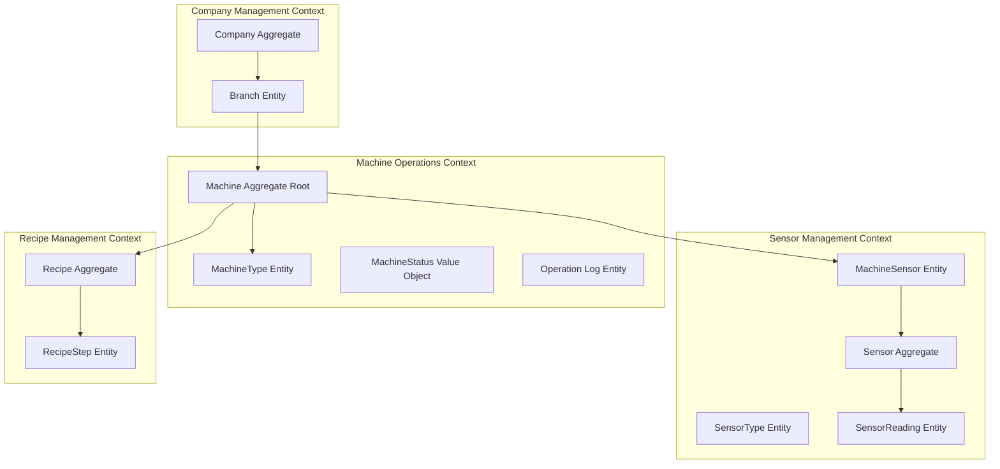
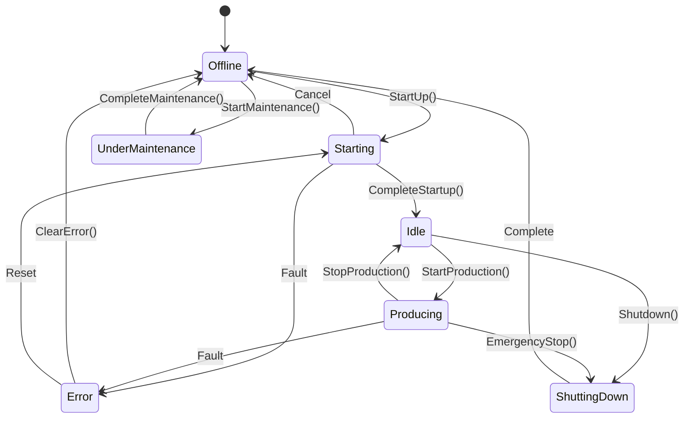

# 🚀 NexusCore - Enterprise Industrial IoT Platform

[](https://dotnet.microsoft.com/download/dotnet/9.0)
[](https://martinfowler.com/tags/domain%20driven%20design.html)
[](https://docs.microsoft.com/en-us/dotnet/architecture/microservices/microservice-ddd-cqrs-patterns/)
[](LICENSE)
[](https://github.com/yourusername/NexusCore/actions)

> **Enterprise-grade Domain-Driven Industrial IoT platform for intelligent manufacturing control and monitoring**

## 📖 Table of Contents

- [🌟 Overview](#-overview)
- [🏛️ Domain-Driven Architecture](#️-domain-driven-architecture)
- [📊 Domain Model](#-domain-model)
- [🔌 Sensor System](#-sensor-system)
- [💾 Database Design](#-database-design)
- [🚀 Getting Started](#-getting-started)
- [📚 API Documentation](#-api-documentation)
- [🎯 Domain Events & Integration](#-domain-events--integration)
- [⚙️ Configuration](#️-configuration)
- [🧪 Testing Strategy](#-testing-strategy)
- [📊 Performance & Monitoring](#-performance--monitoring)
- [🔧 Troubleshooting](#-troubleshooting)
- [🤝 Contributing](#-contributing)
- [📄 License](#-license)

## 🌟 Overview

**NexusCore** is a sophisticated enterprise-grade Industrial IoT platform built with Domain-Driven Design principles. It provides intelligent real-time monitoring, automated control, and comprehensive analytics for industrial manufacturing processes, with a special focus on temperature-sensitive production environments.

### 🎯 Core Capabilities

- **Domain-Driven Design**: Rich domain model with business logic encapsulation
- **Real-time Intelligence**: Sub-second response with predictive analytics
- **Safety-First Architecture**: Automated interlocks with state machine controls
- **Enterprise Integration**: Event-driven architecture with CQRS patterns
- **Industrial Standards**: ModBus RTU, OPC UA ready, Industry 4.0 compliant

### 🏭 Target Industries

- **Food & Beverage Manufacturing**: Temperature-critical production processes
- **Chemical Processing**: Precise environmental control systems
- **Pharmaceutical Manufacturing**: GMP-compliant production monitoring
- **Industrial Automation**: General-purpose sensor management

## 🏛️ Domain-Driven Architecture

### 📐 Clean Architecture Layers

```
┌─────────────────────────────────────────────────────────────────┐
│                    Presentation Layer                           │
│  ┌─────────────┐  ┌─────────────┐  ┌─────────────┐           │
│  │   Web API   │  │  Dashboard  │  │   SignalR   │           │
│  │  REST/gRPC  │  │   Blazor    │  │  Real-time  │           │
│  └─────────────┘  └─────────────┘  └─────────────┘           │
├─────────────────────────────────────────────────────────────────┤
│                    Application Layer                            │
│  ┌─────────────┐  ┌─────────────┐  ┌─────────────┐           │
│  │  Commands   │  │   Queries   │  │   Events    │           │
│  │    CQRS     │  │  Handlers   │  │  Handlers   │           │
│  └─────────────┘  └─────────────┘  └─────────────┘           │
├─────────────────────────────────────────────────────────────────┤
│                    Domain Layer (Core)                          │
│  ┌─────────────┐  ┌─────────────┐  ┌─────────────┐           │
│  │  Entities   │  │Value Objects│  │Domain Events│           │
│  │& Aggregates │  │  & Enums    │  │& Exceptions │           │
│  └─────────────┘  └─────────────┘  └─────────────┘           │
├─────────────────────────────────────────────────────────────────┤
│                  Infrastructure Layer                           │
│  ┌─────────────┐  ┌─────────────┐  ┌─────────────┐           │
│  │ EF Core 8   │  │  ModBus     │  │  Message    │           │
│  │ SQL Server  │  │  Services   │  │   Broker    │           │
│  └─────────────┘  └─────────────┘  └─────────────┘           │
└─────────────────────────────────────────────────────────────────┘
```

### 🎭 Domain Bounded Contexts



## 📊 Domain Model

### 🏢 Company Aggregate

The Company aggregate manages organizational hierarchy with branches and their associated machines.

```csharp
public class Company : BaseEntity
{
    // Properties with private setters for encapsulation
    public string Name { get; private set; }
    public string Address { get; private set; }
    public string PhoneNumber { get; private set; }
    public string Email { get; private set; }
    public bool IsActive { get; private set; }
    public DateTime CreatedAt { get; private set; }
    
    // Collections
    public IReadOnlyCollection<Branch> Branches => _branches.AsReadOnly();
    
    // Rich domain behaviors
    public void AddBranch(Branch branch)
    {
        // Business rules enforcement
        if (!IsActive)
            throw new InvalidOperationException("Cannot add branch to inactive company");
            
        _branches.Add(branch);
        AddDomainEvent(new BranchAddedEvent(Id, branch.Id));
    }
    
    public void Deactivate()
    {
        if (_branches.Any(b => b.IsActive))
            throw new InvalidOperationException("Cannot deactivate company with active branches");
            
        IsActive = false;
    }
}
```

### 🏭 Machine Aggregate Root

The Machine aggregate is the core of the system, managing operational state, sensors, and production activities.

#### 🔄 Machine State Machine



#### 🎯 Machine Behaviors

```csharp
public class Machine : BaseEntity
{
    // State management
    public MachineStatus Status { get; private set; }
    
    // Rich behaviors with business logic
    public void StartProduction(Recipe recipe, string batchNumber, string @operator)
    {
        // Validate business rules
        if (!Status.CanStartProduction())
            throw new InvalidOperationException($"Cannot start production in {Status} status");
            
        if (!recipe.CanBeUsedForProduction())
            throw new InvalidOperationException("Recipe is not approved for production");
            
        // State transition
        TransitionToStatus(MachineStatus.Producing, @operator);
        
        // Update domain state
        CurrentRecipe = recipe;
        CurrentBatchNumber = batchNumber;
        ProductionStartedAt = DateTime.UtcNow;
        
        // Create audit log
        var log = MachineOperationLog.CreateProductionLog(this, recipe.Id, batchNumber, true);
        _operationLogs.Add(log);
        
        // Raise domain event
        AddDomainEvent(new ProductionStartedEvent(Id, recipe.Id, batchNumber));
    }
    
    public void ReportError(string errorDescription, string errorCode, string detectedBy)
    {
        TransitionToStatus(MachineStatus.Error, detectedBy);
        
        var log = MachineOperationLog.CreateError(
            this, 
            EventTypeEnum.SystemError, 
            errorDescription, 
            detectedBy, 
            errorCode);
            
        _operationLogs.Add(log);
        AddDomainEvent(new MachineErrorOccurredEvent(Id, errorCode, errorDescription));
    }
}
```

### 📋 Recipe Management

Recipes contain production parameters with version control and approval workflows.

```csharp
public class Recipe : BaseEntity
{
    // Temperature parameters
    public decimal HeatingTemperature { get; private set; }
    public decimal CoolingTemperature { get; private set; }
    public decimal PouringTemperature { get; private set; }
    public decimal TemperatureTolerance { get; private set; }
    
    // Version control
    public int Version { get; private set; }
    public bool IsApproved { get; private set; }
    
    // Recipe steps
    public IReadOnlyCollection<RecipeStep> Steps => _steps.AsReadOnly();
    
    // Domain operations
    public void SetTemperatures(decimal heating, decimal cooling, decimal pouring)
    {
        // Validate temperature logic
        if (heating < 0 || heating > 200)
            throw new ArgumentException("Heating temperature must be between 0°C and 200°C");
            
        if (pouring < cooling || pouring > heating)
            throw new ArgumentException("Pouring temperature must be between cooling and heating");
            
        HeatingTemperature = heating;
        CoolingTemperature = cooling;
        PouringTemperature = pouring;
        
        // Auto-increment version on parameter change
        if (IsApproved)
        {
            Version++;
            IsApproved = false; // Requires re-approval
        }
    }
    
    public Recipe Clone(string newCode, string newName)
    {
        var clone = new Recipe(newName, newCode, HeatingTemperature, CoolingTemperature, PouringTemperature);
        
        // Copy all steps
        foreach (var step in _steps.OrderBy(s => s.StepNumber))
        {
            clone.AddStep(step.StepNumber, step.Description, step.DurationMinutes, step.TargetTemperature);
        }
        
        return clone;
    }
}
```

### 🌡️ Sensor Domain Model

```csharp
public class Sensor : BaseEntity
{
    // Configuration
    public SensorTypeEnum SensorType { get; private set; }
    public string Name { get; private set; }
    public int ModBusAddress { get; private set; }
    public MeasurementUnitType UnitType { get; private set; }
    
    // Calibration management
    public DateTime? LastCalibratedAt { get; private set; }
    public int CalibrationIntervalDays { get; private set; }
    
    // Reading management
    public SensorReading RecordReading(decimal value, DateTime? timestamp = null)
    {
        if (!IsActive)
            throw new InvalidOperationException("Cannot record readings for inactive sensor");
            
        // Validate reading based on sensor type
        if (!IsValidReading(value))
            throw new InvalidSensorReadingException($"Invalid reading {value} for sensor type {SensorType}");
            
        var reading = new SensorReading(this, value, timestamp ?? DateTime.UtcNow);
        _readings.Add(reading);
        
        return reading;
    }
    
    public bool IsCalibrationDue()
    {
        if (LastCalibratedAt == null) return true;
        
        var nextCalibrationDate = LastCalibratedAt.Value.AddDays(CalibrationIntervalDays);
        return DateTime.UtcNow >= nextCalibrationDate;
    }
}
```

### 🔧 Value Objects

#### MachineStatus Value Object

```csharp
public sealed class MachineStatus : ValueObject
{
    public static readonly MachineStatus Offline = new("Offline", 0, false, false);
    public static readonly MachineStatus Online = new("Online", 1, true, true);
    public static readonly MachineStatus UnderMaintenance = new("UnderMaintenance", 2, false, false);
    public static readonly MachineStatus Error = new("Error", 3, true, false);
    public static readonly MachineStatus Starting = new("Starting", 4, true, false);
    public static readonly MachineStatus ShuttingDown = new("ShuttingDown", 5, true, false);
    public static readonly MachineStatus Idle = new("Idle", 6, true, true);
    public static readonly MachineStatus Producing = new("Producing", 7, true, true);
    
    public string Name { get; }
    public int Code { get; }
    public bool IsPowered { get; }
    public bool CanAcceptCommands { get; }
    
    public bool CanTransitionTo(MachineStatus newStatus)
    {
        // State machine transition rules
        return (Name, newStatus.Name) switch
        {
            ("Offline", "Starting") => true,
            ("Offline", "UnderMaintenance") => true,
            ("Starting", "Online") => true,
            ("Starting", "Idle") => true,
            ("Starting", "Error") => true,
            ("Idle", "Producing") => true,
            ("Producing", "Idle") => true,
            // ... other transitions
            _ => false
        };
    }
}
```

## 🔌 Sensor System

### 🌡️ Temperature Sensors (4 units)

| Sensor | Name | ModBus Address | Range | Purpose | Domain Entity |
|--------|------|----------------|-------|---------|---------------|
| **T-1** | Tank Bottom Temp | `8` | -14°C to 65°C | Monitor material temperature at tank bottom | `Sensor` with `SensorTypeEnum.TankBottomTemp` |
| **T-2** | Tank Wall Temp | `9` | -14°C to 65°C | Monitor material temperature at tank wall | `Sensor` with `SensorTypeEnum.TankWallTemp` |
| **T-3** | Pump Temp | `10` | -10°C to 50°C | Monitor pump/circulation temperature | `Sensor` with `SensorTypeEnum.PumpTemp` |
| **T-4** | Fountain Temp | `11` | -14°C to 65°C | Monitor dispensing temperature | `Sensor` with `SensorTypeEnum.FountainTemp` |

### 🔌 Digital Sensors (3 units)

| Sensor | Name | ModBus Address | Type | Purpose | Domain Entity |
|--------|------|----------------|------|---------|---------------|
| **D-1** | Pedal | `1 (Bit 0)` | Boolean | Manual dispensing control | `Sensor` with `SensorTypeEnum.Pedal` |
| **D-2** | Cover Sensor | `1 (Bit 1)` | Boolean | Safety interlock for cover | `Sensor` with `SensorTypeEnum.CoverSensor` |
| **D-3** | E-Stop | `1 (Bit 2)` | Boolean | Emergency stop button | `Sensor` with `SensorTypeEnum.EmergencyStop` |

### 📊 Sensor Reading Domain Model

```csharp
public class SensorReading : BaseEntity
{
    public Guid SensorRef { get; private set; }
    public Sensor Sensor { get; private set; }
    public DateTime Timestamp { get; private set; }
    public decimal Value { get; private set; }
    public ReadingQuality Quality { get; private set; }
    public bool IsProcessed { get; private set; }
    
    // Business logic
    public void MarkAsProcessed()
    {
        if (IsProcessed) return; // Idempotent
        
        IsProcessed = true;
        ProcessedAt = DateTime.UtcNow;
    }
    
    public bool IsStale(TimeSpan maxAge)
    {
        return DateTime.UtcNow - Timestamp > maxAge;
    }
    
    public string GetFormattedValue()
    {
        return Sensor.UnitType switch
        {
            MeasurementUnitType.Temperature => $"{Value:F1}°C",
            MeasurementUnitType.Boolean => Value == 1 ? "ON" : "OFF",
            MeasurementUnitType.Percentage => $"{Value:F1}%",
            _ => Value.ToString("F2")
        };
    }
}
```

## 💾 Database Design

### 🗄️ Entity Framework Core Configuration

```csharp
public class MachineConfiguration : IEntityTypeConfiguration<Machine>
{
    public void Configure(EntityTypeBuilder<Machine> builder)
    {
        builder.ToTable("Machines");
        
        // Value object configuration
        builder.ComplexProperty(m => m.Status, status =>
        {
            status.Property(s => s.Name).HasColumnName("Status");
            status.Property(s => s.Code).HasColumnName("StatusCode");
        });
        
        // Relationships
        builder.HasOne(m => m.Branch)
            .WithMany()
            .HasForeignKey(m => m.BranchRef)
            .OnDelete(DeleteBehavior.Restrict);
            
        builder.HasOne(m => m.Type)
            .WithMany(t => t.Machines)
            .HasForeignKey(m => m.MachineTypeRef)
            .OnDelete(DeleteBehavior.Restrict);
            
        // Collections
        builder.HasMany(m => m.Sensors)
            .WithOne(s => s.Machine)
            .HasForeignKey(s => s.MachineRef)
            .OnDelete(DeleteBehavior.Cascade);
            
        builder.HasMany(m => m.OperationLogs)
            .WithOne(l => l.Machine)
            .HasForeignKey(l => l.MachineRef)
            .OnDelete(DeleteBehavior.Cascade);
    }
}
```

### 📊 Domain Events Table

```sql
CREATE TABLE DomainEvents (
    Id UNIQUEIDENTIFIER PRIMARY KEY DEFAULT NEWID(),
    AggregateId UNIQUEIDENTIFIER NOT NULL,
    AggregateType NVARCHAR(255) NOT NULL,
    EventType NVARCHAR(255) NOT NULL,
    EventData NVARCHAR(MAX) NOT NULL, -- JSON
    OccurredAt DATETIME2 NOT NULL,
    ProcessedAt DATETIME2 NULL,
    UserId NVARCHAR(255) NULL,
    CorrelationId UNIQUEIDENTIFIER NULL,
    INDEX IX_DomainEvents_AggregateId (AggregateId),
    INDEX IX_DomainEvents_OccurredAt (OccurredAt),
    INDEX IX_DomainEvents_ProcessedAt (ProcessedAt) WHERE ProcessedAt IS NULL
);
```

## 🚀 Getting Started

### 📋 Prerequisites

- **.NET 9.0 SDK** or later
- **SQL Server 2022** or later
- **Visual Studio 2022 17.8+** or **VS Code**
- **Docker** (optional, for containerized deployment)
- **ModBus RTU compatible hardware**

### 🔧 Installation

1. **Clone the repository**
   ```bash
   git clone https://github.com/yourusername/NexusCore.git
   cd NexusCore
   ```

2. **Configure environment**
   ```bash
   # Development
   dotnet user-secrets set "ConnectionStrings:DefaultConnection" "Server=localhost;Database=NexusCore;Trusted_Connection=true;TrustServerCertificate=true"
   
   # Production
   export ConnectionStrings__DefaultConnection="Server=prod-server;Database=NexusCore;User Id=sa;Password=YourPassword;TrustServerCertificate=true"
   ```

3. **Run database migrations**
   ```bash
   dotnet ef database update -p src/Infrastructure/NexusCore.Infrastructure -s src/NexusCore.Dashboard.API
   ```

4. **Seed initial data**
   ```bash
   dotnet run --project src/NexusCore.Dashboard.API -- --seed
   ```

5. **Start the application**
   ```bash
   dotnet run --project src/NexusCore.Dashboard.API
   ```

### 🎯 Domain-Driven Usage Examples

```csharp
// Machine operations with domain logic
public class MachineService
{
    public async Task StartProductionAsync(Guid machineId, Guid recipeId, string batchNumber, string operatorName)
    {
        var machine = await _machineRepository.GetByIdAsync(machineId);
        var recipe = await _recipeRepository.GetByIdAsync(recipeId);
        
        // Domain logic enforced in entity
        machine.StartProduction(recipe, batchNumber, operatorName);
        
        // Save changes and publish domain events
        await _unitOfWork.SaveChangesAsync();
        
        // Domain events are automatically published
        // e.g., ProductionStartedEvent, MachineStatusChangedEvent
    }
    
    public async Task HandleSensorErrorAsync(Guid machineId, Guid sensorId, string errorCode)
    {
        var machine = await _machineRepository.GetByIdAsync(machineId);
        var sensor = machine.Sensors.FirstOrDefault(s => s.SensorRef == sensorId);
        
        if (sensor != null)
        {
            // Business rule: Critical sensors cause machine error
            if (IsCriticalSensor(sensor))
            {
                machine.ReportError(
                    $"Critical sensor {sensor.Name} failed", 
                    errorCode, 
                    "System");
            }
            
            await _unitOfWork.SaveChangesAsync();
        }
    }
}
```

## 📚 API Documentation

### 🎯 Command/Query Separation (CQRS)

#### Commands (Write Operations)

```csharp
// Start Production Command
public class StartProductionCommand : IRequest<Result>
{
    public Guid MachineId { get; set; }
    public Guid RecipeId { get; set; }
    public string BatchNumber { get; set; }
    public string OperatorName { get; set; }
}

// Command Handler
public class StartProductionCommandHandler : IRequestHandler<StartProductionCommand, Result>
{
    public async Task<Result> Handle(StartProductionCommand request, CancellationToken cancellationToken)
    {
        var machine = await _machineRepository.GetByIdAsync(request.MachineId);
        var recipe = await _recipeRepository.GetByIdAsync(request.RecipeId);
        
        // Execute domain logic
        machine.StartProduction(recipe, request.BatchNumber, request.OperatorName);
        
        await _unitOfWork.SaveChangesAsync(cancellationToken);
        
        return Result.Success();
    }
}
```

#### Queries (Read Operations)

```csharp
// Get Machine Status Query
public class GetMachineStatusQuery : IRequest<MachineStatusDto>
{
    public Guid MachineId { get; set; }
}

// Query Handler
public class GetMachineStatusQueryHandler : IRequestHandler<GetMachineStatusQuery, MachineStatusDto>
{
    public async Task<MachineStatusDto> Handle(GetMachineStatusQuery request, CancellationToken cancellationToken)
    {
        var result = await _context.Machines
            .Where(m => m.Id == request.MachineId)
            .Select(m => new MachineStatusDto
            {
                MachineId = m.Id,
                Status = m.Status.Name,
                StatusCode = m.Status.Code,
                IsPowered = m.Status.IsPowered,
                CanAcceptCommands = m.Status.CanAcceptCommands,
                CurrentRecipe = m.CurrentRecipe != null ? new RecipeDto
                {
                    Id = m.CurrentRecipe.Id,
                    Name = m.CurrentRecipe.Name,
                    HeatingTemperature = m.CurrentRecipe.HeatingTemperature
                } : null,
                CurrentBatchNumber = m.CurrentBatchNumber,
                ProductionStartedAt = m.ProductionStartedAt,
                TotalOperatingHours = m.TotalOperatingHours,
                IsMaintenanceDue = m.NextMaintenanceDate <= DateTime.UtcNow,
                Sensors = m.Sensors.Select(s => new SensorStatusDto
                {
                    SensorId = s.Id,
                    Name = s.Name,
                    IsActive = s.IsActive,
                    IsCalibrationDue = s.IsCalibrationDue(),
                    LatestReading = s.GetLatestReading()
                }).ToList()
            })
            .FirstOrDefaultAsync(cancellationToken);
            
        return result;
    }
}
```

### 🔌 REST API Endpoints

#### Machine Operations
```http
POST /api/machines/{id}/start-production
Content-Type: application/json
Authorization: Bearer {token}

{
  "recipeId": "3fa85f64-5717-4562-b3fc-2c963f66afa6",
  "batchNumber": "BATCH-2024-001",
  "operatorName": "John Doe"
}
```

#### Machine Status
```http
GET /api/machines/{id}/status
Authorization: Bearer {token}

Response:
{
  "machineId": "3fa85f64-5717-4562-b3fc-2c963f66afa6",
  "status": "Producing",
  "statusCode": 7,
  "isPowered": true,
  "canAcceptCommands": true,
  "currentRecipe": {
    "id": "123e4567-e89b-12d3-a456-426614174000",
    "name": "Dark Chocolate Premium",
    "heatingTemperature": 47.0
  },
  "currentBatchNumber": "BATCH-2024-001",
  "productionStartedAt": "2024-01-15T10:30:00Z",
  "totalOperatingHours": 1250.5,
  "isMaintenanceDue": false,
  "sensors": [
    {
      "sensorId": "sensor-1",
      "name": "Tank Bottom Temperature",
      "isActive": true,
      "isCalibrationDue": false,
      "latestReading": 45.5
    }
  ]
}
```

#### Emergency Stop
```http
POST /api/machines/{id}/emergency-stop
Authorization: Bearer {token}

{
  "reason": "Safety concern detected",
  "triggeredBy": "Operator"
}
```

## 🎯 Domain Events & Integration

### 📡 Event-Driven Architecture

```csharp
// Domain Event
public class MachineStatusChangedEvent : IDomainEvent
{
    public Guid MachineId { get; }
    public string OldStatus { get; }
    public string NewStatus { get; }
    public DateTime OccurredAt { get; }
    public string TriggeredBy { get; }
    
    public MachineStatusChangedEvent(Guid machineId, string oldStatus, string newStatus, string triggeredBy)
    {
        MachineId = machineId;
        OldStatus = oldStatus;
        NewStatus = newStatus;
        TriggeredBy = triggeredBy;
        OccurredAt = DateTime.UtcNow;
    }
}

// Event Handler
public class MachineStatusChangedEventHandler : INotificationHandler<MachineStatusChangedEvent>
{
    public async Task Handle(MachineStatusChangedEvent notification, CancellationToken cancellationToken)
    {
        // Update dashboard via SignalR
        await _hubContext.Clients.All.SendAsync("MachineStatusChanged", new
        {
            notification.MachineId,
            notification.NewStatus,
            notification.OccurredAt
        });
        
        // Log to audit trail
        await _auditService.LogAsync(new AuditEntry
        {
            EntityType = "Machine",
            EntityId = notification.MachineId,
            Action = "StatusChanged",
            OldValue = notification.OldStatus,
            NewValue = notification.NewStatus,
            UserId = notification.TriggeredBy,
            Timestamp = notification.OccurredAt
        });
        
        // Send alerts if needed
        if (notification.NewStatus == "Error")
        {
            await _alertService.SendCriticalAlertAsync(
                $"Machine {notification.MachineId} entered error state",
                AlertPriority.High);
        }
    }
}
```

### 🔄 Integration Events

```csharp
// Integration Event for external systems
public class ProductionCompletedIntegrationEvent : IntegrationEvent
{
    public Guid MachineId { get; set; }
    public string BatchNumber { get; set; }
    public Guid RecipeId { get; set; }
    public int UnitsProduced { get; set; }
    public decimal TotalOperatingHours { get; set; }
    public DateTime StartedAt { get; set; }
    public DateTime CompletedAt { get; set; }
    public Dictionary<string, object> QualityMetrics { get; set; }
}

// Publish to message broker
public class IntegrationEventService : IIntegrationEventService
{
    private readonly IServiceBus _serviceBus;
    
    public async Task PublishAsync(IntegrationEvent @event)
    {
        var message = new Message
        {
            MessageId = @event.Id.ToString(),
            Body = JsonSerializer.SerializeToUtf8Bytes(@event),
            Label = @event.GetType().Name,
            CorrelationId = @event.CorrelationId
        };
        
        await _serviceBus.SendAsync(message);
    }
}
```

## ⚙️ Configuration

### 🔧 Domain Configuration

```json
{
  "DomainSettings": {
    "Machine": {
      "MaxOperatingTemperature": 65.0,
      "MinOperatingTemperature": -14.0,
      "DefaultMaintenanceIntervalHours": 720,
      "MaxContinuousOperatingHours": 168
    },
    "Sensor": {
      "DefaultCalibrationIntervalDays": 90,
      "ReadingStaleThresholdSeconds": 60,
      "MaxReadingsToKeep": 10000
    },
    "Recipe": {
      "DefaultTemperatureTolerance": 2.0,
      "MaxStepsPerRecipe": 20,
      "RequireApprovalForProduction": true
    },
    "Production": {
      "MinBatchDurationMinutes": 5,
      "MaxBatchDurationHours": 24,
      "AutoStopOnError": true
    }
  },
  "IntegrationSettings": {
    "ServiceBus": {
      "ConnectionString": "Endpoint=sb://nexuscore.servicebus.windows.net/;SharedAccessKeyName=RootManageSharedAccessKey;SharedAccessKey=xxx",
      "TopicName": "nexuscore-events"
    },
    "SignalR": {
      "HubUrl": "/hubs/machine-status",
      "EnableDetailedErrors": false
    }
  }
}
```

### 🌍 Multi-Language Support

```csharp
// Domain Exception Messages
public class DomainExceptionMessages
{
    public static string GetMessage(string key, string culture = "en")
    {
        return culture switch
        {
            "ar" => key switch
            {
                "CannotStartProductionInCurrentStatus" => "لا يمكن بدء الإنتاج في الحالة الحالية",
                "RecipeNotApprovedForProduction" => "الوصفة غير معتمدة للإنتاج",
                "MachineNotOfflineForMaintenance" => "يجب إيقاف الماكينة قبل الصيانة",
                "SensorCalibrationOverdue" => "يجب معايرة جهاز الاستشعار",
                _ => key
            },
            _ => key switch
            {
                "CannotStartProductionInCurrentStatus" => "Cannot start production in current status",
                "RecipeNotApprovedForProduction" => "Recipe is not approved for production",
                "MachineNotOfflineForMaintenance" => "Machine must be offline for maintenance",
                "SensorCalibrationOverdue" => "Sensor calibration is overdue",
                _ => key
            }
        };
    }
}
```

## 🧪 Testing Strategy

### 🧪 Domain Unit Tests

```csharp
[TestClass]
public class MachineTests
{
    [TestMethod]
    public void StartProduction_WhenMachineIsIdle_ShouldTransitionToProducing()
    {
        // Arrange
        var machine = new MachineBuilder()
            .WithStatus(MachineStatus.Idle)
            .Build();
            
        var recipe = new RecipeBuilder()
            .WithApproval("QA Manager")
            .Build();
            
        // Act
        machine.StartProduction(recipe, "BATCH-001", "Operator");
        
        // Assert
        Assert.AreEqual(MachineStatus.Producing, machine.Status);
        Assert.AreEqual(recipe, machine.CurrentRecipe);
        Assert.AreEqual("BATCH-001", machine.CurrentBatchNumber);
        Assert.IsNotNull(machine.ProductionStartedAt);
    }
    
    [TestMethod]
    [ExpectedException(typeof(InvalidOperationException))]
    public void StartProduction_WhenMachineIsOffline_ShouldThrowException()
    {
        // Arrange
        var machine = new MachineBuilder()
            .WithStatus(MachineStatus.Offline)
            .Build();
            
        var recipe = new RecipeBuilder().Build();
        
        // Act
        machine.StartProduction(recipe, "BATCH-001", "Operator");
        
        // Assert - Exception expected
    }
}
```

### 🧪 Integration Tests

```csharp
[TestClass]
public class MachineIntegrationTests : IntegrationTestBase
{
    [TestMethod]
    public async Task StartProduction_ShouldPublishDomainEvents()
    {
        // Arrange
        var machineId = Guid.NewGuid();
        var machine = new MachineBuilder()
            .WithId(machineId)
            .WithStatus(MachineStatus.Idle)
            .Build();
            
        await Repository.AddAsync(machine);
        await UnitOfWork.SaveChangesAsync();
        
        // Act
        var command = new StartProductionCommand
        {
            MachineId = machineId,
            RecipeId = Guid.NewGuid(),
            BatchNumber = "BATCH-001",
            OperatorName = "Test Operator"
        };
        
        await Mediator.Send(command);
        
        // Assert
        var events = GetPublishedDomainEvents<ProductionStartedEvent>();
        Assert.AreEqual(1, events.Count);
        Assert.AreEqual(machineId, events[0].MachineId);
        
        // Verify SignalR notification was sent
        SignalRMock.Verify(x => x.SendAsync(
            It.IsAny<string>(), 
            It.IsAny<object>(), 
            It.IsAny<CancellationToken>()), 
            Times.Once);
    }
}
```

### 🧪 Behavior-Driven Development (BDD)

```gherkin
Feature: Machine Production Management
  As a machine operator
  I want to start and stop production
  So that I can manufacture products according to recipes

  Background:
    Given I have a machine "CHOCO-001" in "Idle" status
    And I have an approved recipe "Dark Chocolate Premium"
    And I am logged in as "John Doe" with "Operator" role

  Scenario: Start production with valid recipe
    When I start production with recipe "Dark Chocolate Premium" and batch "BATCH-2024-001"
    Then the machine status should be "Producing"
    And the current recipe should be "Dark Chocolate Premium"
    And a production started event should be published
    And an audit log entry should be created

  Scenario: Cannot start production when machine is offline
    Given the machine "CHOCO-001" is in "Offline" status
    When I try to start production with recipe "Dark Chocolate Premium"
    Then I should receive an error "Cannot start production in Offline status"
    And the machine status should remain "Offline"
```

## 📊 Performance & Monitoring

### 🚀 Performance Metrics

```csharp
// Domain Performance Monitoring
public class DomainMetrics
{
    private readonly IMetrics _metrics;
    
    public void RecordCommandExecution(string commandName, long elapsedMilliseconds)
    {
        _metrics.Measure.Histogram.Update(
            new HistogramOptions
            {
                Name = "domain_command_duration",
                Tags = new MetricTags("command", commandName),
                MeasurementUnit = Unit.Milliseconds
            },
            elapsedMilliseconds);
    }
    
    public void RecordDomainEvent(string eventName)
    {
        _metrics.Measure.Counter.Increment(
            new CounterOptions
            {
                Name = "domain_events_published",
                Tags = new MetricTags("event", eventName)
            });
    }
    
    public void RecordBusinessRuleViolation(string ruleName)
    {
        _metrics.Measure.Counter.Increment(
            new CounterOptions
            {
                Name = "business_rule_violations",
                Tags = new MetricTags("rule", ruleName)
            });
    }
}
```

### 📈 Health Checks

```csharp
public class DomainHealthCheck : IHealthCheck
{
    public async Task<HealthCheckResult> CheckHealthAsync(
        HealthCheckContext context, 
        CancellationToken cancellationToken = default)
    {
        var data = new Dictionary<string, object>();
        
        try
        {
            // Check critical domain services
            var activeMachines = await _machineRepository.CountAsync(m => m.IsActive);
            var overdueMaintenance = await _machineRepository.CountAsync(m => m.IsMaintenanceDue());
            var uncalibratedSensors = await _sensorRepository.CountAsync(s => s.IsCalibrationDue());
            
            data["activeMachines"] = activeMachines;
            data["machinesRequiringMaintenance"] = overdueMaintenance;
            data["sensorsRequiringCalibration"] = uncalibratedSensors;
            
            if (overdueMaintenance > 0 || uncalibratedSensors > 0)
            {
                return HealthCheckResult.Degraded(
                    "Some machines or sensors require attention",
                    data: data);
            }
            
            return HealthCheckResult.Healthy("Domain model is healthy", data);
        }
        catch (Exception ex)
        {
            return HealthCheckResult.Unhealthy(
                "Domain health check failed",
                exception: ex,
                data: data);
        }
    }
}
```

## 🔧 Troubleshooting

### ❌ Domain-Specific Issues

#### 1. Business Rule Violations
**Symptoms:**
- `InvalidOperationException` with business rule message
- Commands rejected by domain logic
- State transition failures

**Solutions:**
```csharp
// Check preconditions before executing commands
var machine = await _machineRepository.GetByIdAsync(machineId);

// Verify business rules
if (!machine.Status.CanStartProduction())
{
    return Result.Failure($"Cannot start production in {machine.Status} status");
}

if (!recipe.IsApproved)
{
    return Result.Failure("Recipe must be approved before use in production");
}

// Safe to proceed
machine.StartProduction(recipe, batchNumber, operatorName);
```

#### 2. Domain Event Processing
**Symptoms:**
- Events not being published
- Event handlers not executing
- Missing audit trails

**Solutions:**
```csharp
// Ensure domain events are dispatched
public class UnitOfWork : IUnitOfWork
{
    public async Task<int> SaveChangesAsync(CancellationToken cancellationToken = default)
    {
        // Dispatch domain events before saving
        await DispatchDomainEventsAsync();
        
        // Save changes to database
        var result = await _context.SaveChangesAsync(cancellationToken);
        
        // Publish integration events after successful save
        await PublishIntegrationEventsAsync();
        
        return result;
    }
    
    private async Task DispatchDomainEventsAsync()
    {
        var domainEntities = _context.ChangeTracker
            .Entries<BaseEntity>()
            .Where(x => x.Entity.DomainEvents?.Any() == true)
            .ToList();
            
        var domainEvents = domainEntities
            .SelectMany(x => x.Entity.DomainEvents)
            .ToList();
            
        domainEntities.ForEach(entity => entity.Entity.ClearDomainEvents());
        
        foreach (var domainEvent in domainEvents)
        {
            await _mediator.Publish(domainEvent);
        }
    }
}
```

### 🐛 Debugging Domain Logic

```csharp
// Domain Debugging Extensions
public static class DomainDebuggingExtensions
{
    public static void LogStateTransition(this Machine machine, MachineStatus newStatus, ILogger logger)
    {
        logger.LogInformation(
            "Machine {MachineId} transitioning from {OldStatus} to {NewStatus}",
            machine.Id,
            machine.Status,
            newStatus);
    }
    
    public static void ValidateInvariants(this Machine machine)
    {
        if (machine.Status.Equals(MachineStatus.Producing) && machine.CurrentRecipe == null)
        {
            throw new InvalidOperationException(
                "Invariant violation: Machine is producing but has no current recipe");
        }
        
        if (machine.Status.Equals(MachineStatus.UnderMaintenance) && !machine.Status.Equals(MachineStatus.Offline))
        {
            throw new InvalidOperationException(
                "Invariant violation: Machine under maintenance must be offline");
        }
    }
}
```

## 🤝 Contributing

### 🎯 Domain-Driven Development Guidelines

1. **Ubiquitous Language**: Use domain terms consistently
   - ✅ `machine.StartProduction(recipe, batchNumber)`
   - ❌ `machine.BeginManufacturing(formula, lotNumber)`

2. **Aggregate Boundaries**: Respect aggregate roots
   - ✅ Access sensors through machine: `machine.Sensors`
   - ❌ Direct sensor modification: `sensor.Machine = newMachine`

3. **Business Logic**: Keep in domain layer
   - ✅ Validation in entity methods
   - ❌ Business rules in controllers or services

4. **Domain Events**: Raise for significant state changes
   - ✅ `ProductionStartedEvent`, `MachineErrorOccurredEvent`
   - ❌ `DataUpdatedEvent`, `PropertyChangedEvent`

### 📝 Code Review Checklist

- [ ] Domain logic is encapsulated in entities
- [ ] Value objects are immutable
- [ ] Aggregate boundaries are respected
- [ ] Domain events are raised for significant changes
- [ ] Business rules are enforced consistently
- [ ] Tests cover domain behaviors
- [ ] No anemic domain models

## 📄 License

This project is licensed under the **MIT License** - see the [LICENSE](LICENSE) file for details.

---

## 🌟 Acknowledgments

- **Domain-Driven Design Community**: Eric Evans, Vaughn Vernon, and the DDD community
- **Clean Architecture**: Robert C. Martin (Uncle Bob) for architectural principles  
- **.NET Community**: Microsoft and the open-source contributors
- **Industrial Automation Standards**: ISA, IEC, and Industry 4.0 initiatives

---

<div align="center">

**⭐ Star this repository if you find it valuable! ⭐**

**🚀 Built with Domain-Driven Design for Industrial Excellence 🚀**

**NexusCore - Where Domain Logic Meets Industrial Innovation**

</div>
